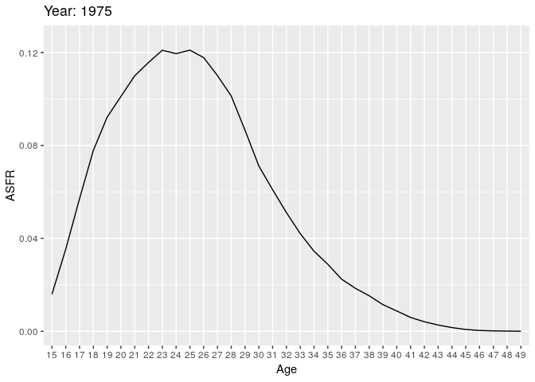
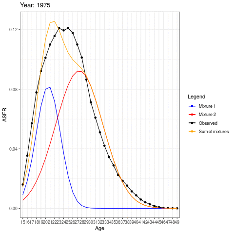

# Tempo

## Outline

- Introduction and a tempo simulation
- Bongaarts and Feeney's formula
- An application to the United States
- Two Americas?
- EM algorithm for unmixing mixtures
- An application to two Americas.

Additional resources:

  - @sullivan2005age: An early paper (by a Berkeley Demog student!) focusing on first birth hazards.
  - @burkimsher2017evolution: A descriptive paper, which you can mostly skip. But see especially section 7, where she argues that her findings contradict Sullivan for the United States.
  - @hastie2009elements: A textbook example of expectation-maximization algorithm applied to mixture of two normals in Section 8.5.
  - Victor Lavrenko. Youtube video : "EM algorithm: how it works" <https://www.youtube.com/watch?v=REypj2sy_5U>. 
  - @bongaarts1998quantum

## Introduction

What we see is superficial. Heterogeneous models reveal what's "really" going on. (Or do they?). Until the past sections, population hazards mislead. However in this section, homogeneous fertility misleads.
  
We now reverse perspectives:

  - We see differences we see in genotypes, in lineages, in names.
  - These could be due to "real" differences (heterogeneity).
  - But they could also be due to luck: everyone is the same but stochastic outcomes differ.
  - Our models of individual-level randomness will have predicted dynamics, which are themselves interesting but can also be used as a "null" to compare to observations.

### Fertility postponement, a very simple example

  Baseline
  
  - A population has a history of 1 birth per day
  - When women turn age 25, they have a daughter.
  - This gives us a constant stream of births, 365 per year.
  
  Postponement
  
  - Starting on Jan. 1, 2020, everyone postpones childbearing an additional month, until they are aged 25 1/12.
  -  How many births will there be in 2020?
  -  How many births in 2021?
  
  As everybody postpones childbearing for a month, then the first birth of 2020 occurs on February 1st so that 31 babies have not been born by then. This means that during 2020 there are $365-31=334$ births. For this year, births and total fertility rate decrease. However, the postponement doesn't affect the birth stream in 2021 as there will still be one birth per day, even if in the absence of postponing these some of the births should've occured in 2020.
  
### Continuous postponement, a shiny simulation
  To answer these questions, we can use the following shiny app. 
```{r echo=FALSE}
knitr::include_url('https://shiny.demog.berkeley.edu/josh/tempo/', height = '600px')
```


- $R(t)$ Cumulative postponment

- $r(t)$ Incremental postponement $r(t) = R'(t)$


  What is a formula for recovering original birth stream?
  \begin{align}
  \hat{B}_{orig} &= B_{obs} \times (1 + R'(t)) \\
   \text{or}\\
  \hat{B}_{orig} &= B_{obs} \times 1/  \left[1 - R'(t)\right]?
  \end{align}

  Note: this idea of ``recovering original'' is one way to think
  about tempo adjustment.
  
  We can think of the original version as that which should have ocurred in the absence of postponement. Intuitively, it should be higher than the observed birth stream, but how much larger? The table below shows an example of how to recover the original births where each formula refers to the equations above.

```{r, echo=FALSE, message=FALSE}
  library(tidyverse)
  rt <- seq(0.1,0.4,0.1)
  b_obs <- c(91,84, 77, 72 ) 
  b_orig1 <- b_obs*(1+rt)
  b_orig2 <- b_obs/(1-rt)
  b_orig <- tibble(rt,b_obs, b_orig1, b_orig2)
  names(b_orig) <- c("r(t)","B(obs)", "B(orig) formula 1", "B(orig) formula 2")
  knitr::kable(b_orig)
```
  
  The correct formula is equation 2. **NOTE: is this correct? If so, why?** 
  
## Period Shifts: Bongaarts and Feeney's model

In a bigger microsimulation

  - Each period will have births across a range of ages
  - We'll randomly generate the original planned birthdays
  - Then we'll shift by a continuous function $R(t)$.
  

The birth rate of women, $f(a,t)$, aged $a$ in period $t$ is: 
  $$
  f(a,t) = f_0(a - R(t)) (1- R'(t)) q(t)
  $$
  
Where

- $f_0$:  constant baseline schedule (can be normalized to sum to 1).
- $q(t)$: period intensity parameter: "quantum"
- $R(t)$: cumulative shift.
  

An example

$$
f(a,t) = f_0(a - R(t)) (1- R'(t)) q(t)
$$
  
  
- $R_{2019} = 3$
- $R'_{2019} = .1$
- $q(2019) = 1$
  

Give an expression for $f(28,2019)$.

$$ \begin{aligned} 
 f(28,2019) &= f_{0}(28-3)\times(1-0.1)\times(1) \\
  & = (0.9)f_{0}(25)
 \end{aligned}
$$  Therefore, the fertility rate for a 28 year-old in 2019 would be 0.9 of the baseline fertility rate at age 25. Another way of thinking about it is that had there been no postponement, the fertility rate that we are observing in 2019 for this 28 year-old would actually be similar to that of a 25 year old. 

Small changes in the stock can have huge effect in the flows.


### A derivation: due to Rodriguez *NOTE: not sure what the reference is here*

Assume no quantum effects (i.e, no $q(t)$). Take a cohort with cumulative fertility

  $$
  F_0(a) = \int_0^a f(x) \,dx
  $$

  Now put in shifts so that observed fertility is from an age $R(t)$ years earlier. ("28" is the new "25"!)
  $$
  F(a,t) = F_0(a - R(t))  = F_0(a - R(c + a))
  $$
  
  Differentiate with respect to age (which for a cohort is also time $t$), using chain rule
  
  $$ \begin{aligned}
  \frac{d }{dt}F(a,t)= f(a,t) &= F'_{0}(a-R(c+a))\times(1-R'(c+a)) \\
  &= f_0(a - R(t)) \left[1 - R'(t)\right]
  \end{aligned}$$

Let's re-notate our constant quantum result
  $$
  f_0(a,t | R(t) ) = f_0(a - R(t)) \left[1 - R'(t)\right]
  $$
  Then we can incorporate period quantum on the shifted surface:
  $$
  f(a,t) = f_0(a,t | R(t) ) q(t) = f_0(a - R(t)) \left[1 - R'(t)\right]q(t)
  $$

  Note: If we vary quantum before shifts, then $q(t)$ will bleed into neighboring years. (a small effect, but makes model
  messier). **NOTE: I don't understand this, could you explain Josh?**


**Tempo-adjusted TFR:** counter-factual, TFR in absence of timing changes

  $$
  TFR(t) = \int_0^\infty f(a,t) \, da
  $$

  Substituting our shifted birth rates with quantum
  $$
  \begin{aligned}
  TFR(t) &= \int_0^\infty f_0(a - R(t)) \left[1 - R'(t)\right]q(t) da \\
  &=\left[1 - R'(t)\right]q(t) \int_0^\infty f_0(a - R(t))  da \\
  &= TFR_0 \left[1 - R'(t)\right] q(t)\\
  \end{aligned}
  $$
  Without loss of generality, define $TFR_0 = 1$, then 
  
  $$
  q(t) =   \frac{TFR(t)} {1 - R'(t)} \equiv TFR^*(t) 
  $$
  The observed $TFR(t)$ deflated by the rate of change ($1 - R'(t)$) is the BF formula.


How do period schedules change?

  $$
  f(a,t) = f_0(a - R(t)) \left[1 - R'(t)\right]q(t)
  $$


  What is
  $$
  \begin{aligned}
  {\partial \over \partial t} \log f(a,t) &= ?\\
  \\
  & = \frac{d}{dt}log(f_{0}(a-R(t))) + \frac{d}{dt}log(1-R'(t)) + \frac{d}{dt}log(q(t)) \\
  & = \frac{-f'_{0}(a-R(t)) R'(t)}{f_{0}(a-R(t))} - \frac{R''(t)}{1-R'(t)}+ \frac{q'(t)}{q(t)}
  \end{aligned}
  $$
  If we sketch this, where the age is on the x-axis, then the last two components affect the intercept of the curve. If births are postponed, $R'(t)>0$ but if they are actually advanced then $R'(t)<0$, which affects the slope of $ {\partial \over \partial t} \log f(a,t)$.

**Uniform shifts**

- BF model assumes all ages shift by $R(t)$.
- BF model assumes all ages rise or fall by same quantum $q(t)$
- Violating these assumptions means change in mean age will not just reflect "tempo".
- Example: What happens if people have fewer higher order births?
  
**BF recommendation for achieving uniformity**

  Separate estimates for each birth order, and then combine:
  $$
  TFR^*(t) = \sum_i TFR_i^*(t) = \sum_i {TFR_i(t) \over 1 - r_i(t)}
  $$

This will protect against order-specific quantum effects.
  

## An Application to the United States

Tempo adjustment of US fertility using HFD data using Bongaarts-Feeney formula:

1. Read in data and format into an array. 
   Below we show the period fertility rates for all parities at each age for 1933 and 1934 of US women. 
```{r, message=FALSE}
library(data.table)
library(dplyr)
library(knitr)

source("https://raw.githubusercontent.com/josh-goldstein-git/random_demography/master/bookdown-master/codes/tempo_functions.R")
source("https://raw.githubusercontent.com/josh-goldstein-git/random_demography/master/bookdown-master/codes/utility_functions.R")

## age specific fertility rates by birth order for all countries and times
## RR means "rectangles" on Lexis surface
dt <- fread("https://raw.githubusercontent.com/josh-goldstein-git/random_demography/master/bookdown-master/data/zip_w/asfrRRbo.txt", showProgress = FALSE)

dt <- dt[Code == "USA"] ## keep only US
dt <- dt[Age %in% 15:49] ## keep only ages 15 to 49

## put all order fertility into a matrix
fat <- dt[, xtabs(ASFR ~ Age + Year)] # age (rows) by cohort year (column) matrix of ASFR
fat <- as.matrix(unclass(fat)) 
fat1 <- dt[, xtabs(ASFR1 ~ Age + Year)] #age specific fertility rates for parity = 1 
fat2 <- dt[, xtabs(ASFR2 ~ Age + Year)]
fat3 <- dt[, xtabs(ASFR3 ~ Age + Year)]
fat4 <- dt[, xtabs(ASFR4 ~ Age + Year)]
fat5p <- dt[, xtabs(ASFR5p ~ Age + Year)]
year.vec <- colnames(fat)
age.vec <- rownames(fat)
parity.vec <- c("all", 1:5)
fat.array <- array(NA, dim = c(nrow(fat), ncol(fat), length(parity.vec)))
dimnames(fat.array) <- list(age.vec, year.vec, parity.vec)
fat.array[,,"all"] <- fat
fat.array[,,"1"] <- fat1
fat.array[,,"2"] <- fat2
fat.array[,,"3"] <- fat3
fat.array[,,"4"] <- fat4
fat.array[,,"5"] <- fat5p

kable(fat.array[,1:2,"all"], caption="An extract of period age-specific fertility rates") 
``` 

2. Fit bongaarts feeney without birth order
```{r}
tfr.vec <- colSums(fat)          # total fertility rate for each cohort
mu.vec <- apply(fat, 2, get.mean) # mean age at childbearing
rt.vec <- center.diff(mu.vec)     # increments of postponement
adj.tfr.vec <- tfr.vec / (1 - rt.vec) # Assuming no quantum effect, tempo-adjusted TFR
```

```{r, echo=FALSE, fig.cap='Adjusted TFR',fig.height=8}
par(mfrow = c(3,1))
plot(names(mu.vec), mu.vec, xlab = "Year", ylab="Mean age of childbearing")
plot(names(mu.vec), rt.vec, xlab = "Year", ylab= "Shifts")
abline(h =0)
plot(year.vec, tfr.vec, type = "l", xlab = "Year", ylab= "TFR")
lines(year.vec, adj.tfr.vec, lty = 2)
abline(v = c(1945, 2008))
legend("topright", c("Observed TFR", "Tempo-adjusted TFR"), lty= c(1,2))
```

- We see fertility since 1980 has been depressed by postponment
- We see weird dynamics around end of WW2 and great recession.
- What's going on? Here is a closeup

```{r, echo=F, fig.cap='Observed and tempo-adjusted TFRs'}
par(mfrow = c(1,1))
plot(year.vec, tfr.vec, type = "l", xlab = "Year", ylab= "TFR") # Observed TFR
lines(year.vec, adj.tfr.vec, lty = 2) # Tempo-adjusted TFR
abline(v = c(1945, 2008))
abline(h = seq(1.5, 4, .1), col = "grey", lty = 3)
legend("topright", c("Observed TFR", "Tempo-adjusted TFR"), col= c("black","red"), lty=c(1,1))

## can also use function to fit
adj.tfr.vec.from.fun <- bf.fit.simple(fat)$tfr.star
lines(year.vec, adj.tfr.vec.from.fun, col = "red")
```

Now let's look at turbulence around WWII
```{r, echo=FALSE,fig.cap='Change in fertility rates around WWII', fig.height=6}
par(mfrow = c(2,2))
plot(age.vec, fat[,"1944"], type = "l", ylim = c(0, .23),
     ylab = "f(a)",
     xlab = "age a"
     )
lines(age.vec, fat[,"1945"], type = "l", col = "red")
lines(age.vec, fat[,"1946"], type = "l", col = 'orange')
lines(age.vec, fat[,"1947"], type = "l", col = "blue")
legend("topright",
       legend = 1944:1947,
       col = c("black", "red", "orange", "blue"),
       lty = 1)
title("Age specific fertility")
##
plot(1943:1947, mu.vec[paste(1943:1947)],
     ylab = "mu(t)",
     xlab = "t",
     col = c("black", "black", "red", "orange", "blue"),
     pch = 19)
title("Mean ages")
##
plot(1943:1947, rt.vec[paste(1943:1947)],
     ylab = "r(t)",
     xlab = "t",
     col = c("black", "black", "red", "orange", "blue"),
     pch = 19)
title("Changes in mean, centered")
##
plot(1943:1947, tfr.vec[paste(1943:1947)],
     ylab = "tfr",
     xlab = "t",
     ylim = c(1, 4),
     type = "l")
lines(1943:1947, adj.tfr.vec[paste(1943:1947)],
      lty = 2)
title("TFR and adjTFR")
legend("topright", c("Observed TFR", "Tempo-adjusted TFR"), lty=c(1,2))

``` 

From 1945 to 1946, fertility goes up a lot, but more at younger ages. So mean goes down. BF adjustment over-compensates, and has quantum declining.

What's happening from 1944-45?

3. Fit bongaarts feeney with birth order

```{r}
out <- bf.fit(fat.array)  #function to obtain BF tempo-adjusted TFR
adj.tfr.bo.vec <-  out$tfr.star.out[, "bf.tfr.star"] # sum of parity specific tempo-adjusted TFRs
```
```{r, echo=FALSE,fig.cap='TFR by parities', fig.height=6}
par(mfrow = c(1,1))
plot(year.vec, tfr.vec, type = "l", lwd = 2, xlab="Year", ylab= "TFR")
lines(year.vec, adj.tfr.vec, lty = 2)
lines(year.vec, adj.tfr.bo.vec, lty = 1, lwd = 2, col = "red")
legend("topright",
       c("tfr", "tfr* (all parities)", "tfr* (sum of parities)"),
       col = c("black", "black", "red"),
       lty = c(1, 2, 1),
       lwd = c(2,1,2))
```
4. Use HFD data to verify adjusted TFR
  HFD uses a tempo-adjusted TFR that is the sum of the parity specific adjusted BF TFR.
```{r}
## let's check against hfd
hfd.adj.dt <- fread("https://raw.githubusercontent.com/josh-goldstein-git/random_demography/master/bookdown-master/data/zip_w/adjtfrRR.txt", showProgress = FALSE, skip = 2)
hfd.adj.dt <- hfd.adj.dt[Code == "USA"]
```

  We find that:  
  
  - Taking birth order into account smooths out WW2 turbulence (large fluctuations) but increases the variation during the Great Recession.  
  - The baby boom appears to initially be even greater than observed when we take into account birth order, but then it fall more than observed. 
  - Finally, the baby bust was not as bad as it seemed.

```{r, echo=FALSE,fig.cap='TFR by parities using HFD data', fig.height=6}
plot(year.vec, tfr.vec, type = "l", lwd = 2, xlab="Year", ylab= "TFR")
lines(year.vec, adj.tfr.vec, lty = 2)
lines(year.vec, adj.tfr.bo.vec, lty = 1, lwd = 2, col = "red")
lines(hfd.adj.dt$Year, hfd.adj.dt$adjTFR, col = "blue")
legend("topright",
       c("tfr", "tfr* (all parities)", "tfr* (sum of parities)", "HFD adj TFR"),
       col = c("black", "black", "red", "blue"),
       lty = c(1, 2, 1, 1),
       lwd = c(2,1,2,2))

```

### Conclusions

- Baby boom smaller if we account for "pre-ponement".  
- Fertility lull in 1970s and 80s disappears if we account for
    "postponement". 
- Birth order disaggregation improves estimates of shifts from
    changes in mean age
- What happened with the recession?

## Two Americas

  Let's look at births (all orders). Here we have some animations of the ASFR over time. 
```{r, message=FALSE, warning=FALSE, fig.height=7}
my.year.vec <- 1975:2017
# library(devtools)
# install_github("dgrtwo/gganimate")
# install.packages("transformr")
# install.packages("animation")
library(gganimate)
library(data.table)
library(mixtools)
library(ggplot2)

source("https://raw.githubusercontent.com/josh-goldstein-git/random_demography/master/bookdown-master/codes/tempo_mixed_functions.R")
source("https://raw.githubusercontent.com/josh-goldstein-git/random_demography/master/bookdown-master/codes/tempo_functions.R")

# plot1 <- ggplot(data=dt[Year %in% my.year.vec,2:4], aes(x=Age, y= ASFR)) + 
#   geom_line(aes(group=Year))+
#   transition_time(Year)+
#   labs(title = "Year: {frame_time}")

# anim_save("plot1.gif", plot1)
```


During the earlier years, the mean childbearing age seems to be in the early 20s. However with time, the AFR seems to become bimodal. So what is happening here? Are there two underlying groups of women that experience different fertility rates. Now fit mixing model and redo the animation.

**NOTE: Not sure of all the lines in this mixture code. Josh, could you add some notes please?**
```{r mixture1, results='hide'}
## takes few minutes to run
my.fat <- fat[, paste(my.year.vec)]
out <- get.mixed.tfr.star(my.fat)
##
out.all <- out

#Mixture simulation 
if (0) {
mu.mat <- get.coefs.mixed(out.all$fert.fit.list.variable.sigma)$mu.mat
lambda.mat <- get.coefs.mixed(out.all$fert.fit.list.variable.sigma)$lambda.mat
sigma.mat <- get.coefs.mixed(out.all$fert.fit.list.variable.sigma)$sigma.mat
}
mu.mat <- get.coefs.mixed(out.all$fert.fit.list)$mu.mat
lambda.mat <- get.coefs.mixed(out.all$fert.fit.list)$lambda.mat
sigma.mat <- get.coefs.mixed(out.all$fert.fit.list)$sigma.ma

#Temporary comment out until we figure out what these graphs actually are
# matplot(my.year.vec, t(mu.mat))
# abline(v = 2015)## problem here
# points(c(2015, 2015), c(21.5, 30.3))
# 
# matplot(my.year.vec, t(lambda.mat))
# abline(v = 2015)## problem here
# points(c(2015, 2015), c(21.5, 30.3))

## interpolate 1915

colnames(lambda.mat) <- my.year.vec
colnames(mu.mat) <- my.year.vec
lambda.mat[,"2015"] <- (lambda.mat[,"2014"] + lambda.mat[,"2016"])/2
mu.mat[,"2015"]     <- (mu.mat[,"2014"]     + mu.mat[,"2016"])/2
``` 

  Now we create the animation with the normal distributions inside as well as the observed ASFR.
```{r mixture2, fig.height=7}
# Obtaining different ASFRs per group (1 and 2)
my.dt <- dt[Year %in% my.year.vec,]

for (i in 1:length(my.year.vec)){
    my.year <- my.year.vec[i]
    year.vec <- colnames(my.fat)
    fx <- my.fat[,paste(my.year)]
    # fx <- fx/sum(fx)
    x <- as.numeric(names(fx))
    ## par(mfrow = c(1,1))
    # plot(x, fx,
    #      ylim = c(0, .3),
    #      ylab = "normalized fx")
    s <- year.vec == my.year
    this.tfr <- sum(fx)
    fx1.hat <- dnorm(x, mean = mu.mat[1,s], sd = sigma.mat[1,s]) *
        lambda.mat[1,s]* this.tfr
    # lines(x, fx1.hat, col = "red")
    fx2.hat <- dnorm(x, mean = mu.mat[2,s], sd = sigma.mat[2,s]) *
        lambda.mat[2,s] * this.tfr
    # lines(x, fx2.hat, col = "blue")
    # lines(x, fx1.hat + fx2.hat)
    # title(last.year)
    my.dt <- my.dt[Year==my.year, fx := fx]
    my.dt <- my.dt[Year==my.year, fx1 := fx1.hat]
    my.dt <- my.dt[Year==my.year, fx2 := fx2.hat]
    my.dt <- my.dt[Year==my.year, fx1fx2 := fx1.hat + fx2.hat]

}

labels <- c("Observed" = "black", "Mixture 1" = "blue", "Mixture 2" = "red", "Sum of mixtures"="orange")

# plot2 <-
#   ggplot(data=my.dt, aes(x=Age)) + 
#   geom_line(aes( y= ASFR, group=Year, color = "Observed"))+
#   geom_line(aes( y= fx1, group=Year, color = "Mixture 1"))+
#   geom_line(aes( y= fx2, group=Year, color = "Mixture 2"))+
#   geom_line(aes( y= fx1fx2, group=Year, color = "Sum of mixtures"))+
#   labs(color = "Legend") +
#   scale_color_manual(values = labels)+
#   theme_bw()#+
#   transition_time(Year)+
#   labs(title = "Year: {frame_time}")

# anim_save("plot2.gif", plot2)


```

  The animation shows how the distributions operate under the AFSR curve. There could be two separate normal distributions with distinct mean ages of childbearing.

  Let's do tempo adjustment:**NOTE: Help! I don't know how to interpret these graphs**
```{r, fig.height=5}
rt.mat <- t(apply(mu.mat, 1, center.diff))
tfr.vec <- apply(my.fat, 2, sum)
tfr.mat <- lambda.mat * tfr.vec
par(mfrow = c(1,2))

matplot(my.year.vec, t(tfr.mat), ylim = c(0, 3))
tfr.star.mat <- tfr.mat / (1 - rt.mat)
matplot(my.year.vec, t(tfr.star.mat), ylim = c(0,3))

tfr.star.vec <- colSums(tfr.star.mat)

par(mfrow = c(1,1))
plot(my.year.vec, tfr.vec, type = "l",
     ylim = c(1, 3))

lines(my.year.vec, tfr.star.vec, lty = 2)
```

### Mixture
  Let's look at 1st births, again as if their are two latent groups: $A$ and $B$.  (These could be "early moms" / "late moms", non-college / college, pre-marital / marital, lower-class / upper class, $\ldots$)
```{r}
library(mixtools)
  ## simulate 2 normals 
  N <- 1000
  x1 <- rnorm(N, mean = 22, sd = 3) ##
  x2 <- rnorm(2*N, mean = 30, sd = 4)
  ## combine them
  x <- c(x1,x2)
  ## use EM to infer mixture
  out <- normalmixEM(x,
                     lambda = c(.5, .5),
                     mu = c(15, 35),
                     sigma = c(5,5))
  print(out$mu)
  print(out$sigma)
  print(out$lambda)
```
  Seems to work great.

```{r, fig.height = 4}
  ages <- 10:49
  dens1 <- dnorm(x = ages, mean = out$mu[1], sd = out$sigma[1]) * out$lambda[1]
  dens2 <- dnorm(x = ages, mean = out$mu[2], sd = out$sigma[2]) * out$lambda[2]
  par(mfrow = c(1,1))
  hist(x, probability = T, col = "grey")
  lines(ages, dens1, col = "red", lwd = 2)
  lines(ages, dens2, col = "blue", lwd = 2)
  lines(ages, dens1 + dens2, col = "black", lwd = 2)
``` 

### An algorithm for tempo adjustment of mixtures
  
- Fit normal mixture to each year.
- Refit using constant variance (average). This assures shape invariance of each component, fulfilling BF assumption.
- Estimate BF separately for $A$ and $B$, and combine.


- tempo_mixed_results_figure.pdf **NOTE: not sure about this...**
  

## Conclusions 
  
  - Postponement dilutes period births, lowers TFR
  - Tempo-adjustment tries to ``put births back in''
  - Changes in mean work fine if ``shape'' doesn't change
  - Shape can change through heterogeneity
  - With strong assumptions, we can identify heterogeneity
  - Declining quantum for young and postponement for old appears
    to be the story
  
### Caveats
  
  - Who are these latent groups? Do you start out in one and end up in the other? Do you stay in one your whole life?
  - How do we project forward?
  - Can we use other indicators (e.g., social class, education,
    marriage) to get same results?