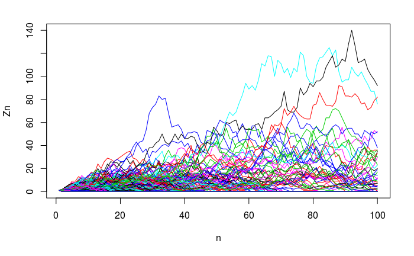
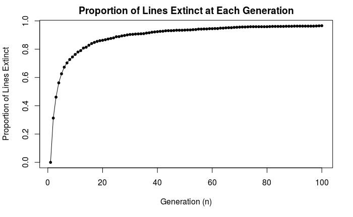
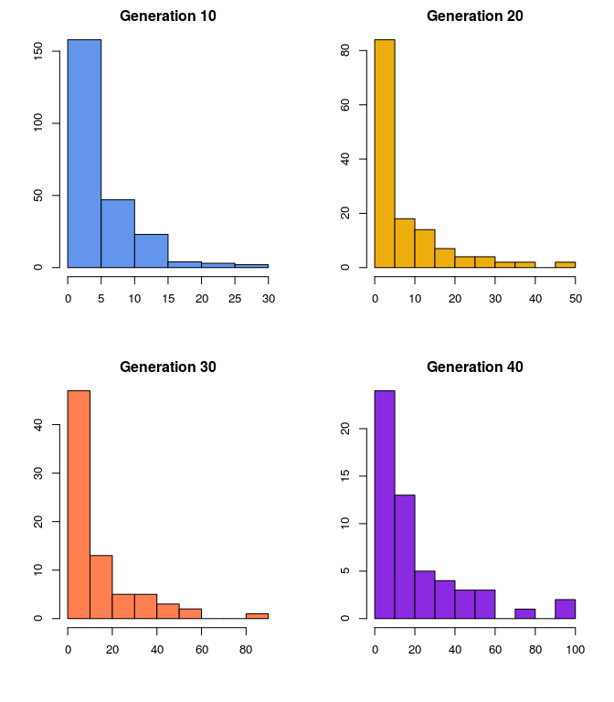
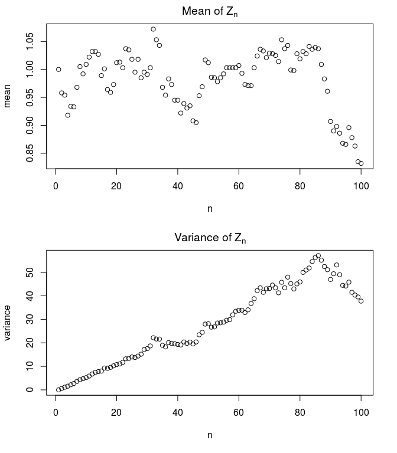

# Problem set 8

## Problems
## Solutions
For the following problems, let $p_0 = 0.3$, $p_1=0.3$, $p_2=0.4$. Use the function $h(z) = p_0 + p_1 z + p_2 z^2$. This gives $m= 0.3(0) + 0.3(1) + 0.4(2) = 1.1$, which is supercritical.  
1. Multiply out $h(z)^3$ algebraically and explain how the coefficient on $z^4$ consists of all of the possible ways for 3 fathers to produce a total of 4 sons
    Finding $h(z)^2$:
    $$\begin{aligned} 
    h(z)^2 &= (p_0 + p_1 z + p_2 z^2)\times(p_0 + p_1 z + p_2 z^2) \\
    &= p_0^2+2p_0p_1z+(2p_0p_2+p_1^2)z^2 + 2p_1p_2z^3 + p_2^2z^4
    \end{aligned}$$
    Multiplying out again:
    $$\begin{aligned}
    h(z)^3 &= h(z)^2 h(z) \\
    &= [p_0^2+2p_0p_1z+(2p_0p_2+p_1^2)z^2 + 2p_1p_2z^3 + p_2^2z^4]\times(p_0 + p_1 z + p_2 z^2) \\
    &= p_0^3 + (3p_0^2p_1)z + (3p_0^2p_2 + 3p_0p_1^2)z^2 +(6p_0p_1p_2+p_1^3)z^3 + \\
    & (3p_0p_2^2+3p_1^2p_2)z^4+ (3p_1p_2^2)z^5 + (p_2^3)z^6\\
    \end{aligned}$$
    To get a total of 4 children, either two of the fathers have 2 sons each and the third has no sons ($p_0p_2^2$), or one of the fathers has 2 sons and the others each have 1 son ($p_1^2p_2$). With three fathers, there are 3 ways for each of these combinations to appear; corresponding to the $3p_0p_2^2+3p_1^2p_2$ coefficient on $z^4$.  
2. Multiply out $h_2(z) = h(h(z))$ algebraically and explain how the coefficient on $z^2$ consists of all of the possible ways for a woman to have 2 grand-daughters.
    $$\begin{aligned}
    h(h(z)) & = p_0+p_1h(z)+p_2h(z)^2 \\
    & = p_0 +p_1[p_0 + p_1 z + p_2 z^2] + p_2[p_0^2+2p_0p_1z+(2p_0p_2+p_1^2)z^2 + 2p_1p_2z^3 + p_2^2z^4] \\
    &= [p_0+p_0p_1+p_0^2p_2] + [2p_0p_1p_2+p_1^2]z +\\
    & [2p_0p_2^2+p_1p_2+p_1^2p_2]z^2 + [2p_1p_2^2]z^3+[p_2^3]z^4
    \end{aligned}$$
    Here are the ways a woman can end up with 2 granddaughters: first, she can have a single daughter who herself has 2 daughters ($p_1p_2$). Or, she can have 2 daughters who then each have 1 daughter ($p_1^2 p_2$). Lastly, she can have 2 daughters, one of which has 2 daughters and one who has no daughters ($2p_0 p_2^2$; note there are two ways for this to happen because there are two daughters in the second generation). These possibilities correspond to the $2p_0p_2^2+p_1p_2+p_1^2p_2$ coefficient on $z^2$  
3. Write an R-program to reproduce 20 entries of the table (This is for our values of $p_0 = 0.3$, $p_1=0.3$, $p_2=0.4$, not the $p_k$ values on wikipedia)

|Generation Number | Extinction probability | Generation Number | Extinction probability 
|---|---|---|---|
| 1 | 0.30000 | 11 | 0.68599|
| 2 | 0.42600 | 12 | 0.69403 |
| 3 | 0.50039 | 13 | 0.70088 |
| 4 | 0.55027  | 14 | 0.70676  |
| 5 | 0.58620  |  15 | 0.71183 |
| 6 | 0.61331  |  16 | 0.71623 |
| 7 | 0.63446 |  17 | 0.72006   |
| 8 | 0.65135  | 18 | 0.72342 |
| 9 | 0.66511  | 19 | 0.72636 |
| 10 | 0.67648  | 20 | 0.72895 |
|---|---|---|---|

The extinction probability is converging to 0.75 (going out to 50 or 60 generations is helpful for observing this).  
Sample code:
```{r, eval=FALSE}
d_zero <- 0
p_zero <- 0.3
p_one <- 0.3
p_two <- 0.4
n_gen <- 20

value_table <- matrix(0, nrow = n_gen, ncol = 2)

d_prev <- d_zero
for (i in 1:n_gen) {
  prob_extinction <- p_zero + d_prev*p_one + (d_prev^2)*p_two
  value_table[i,1] = i
  value_table[i, 2] = prob_extinction
  d_prev <- prob_extinction
}
```
4. Use the quadratic formula to solve for $d$, the probability of ultimate extinction: $d = p_0 + p_1d + p_2d^2$. What do you get for $d$ given our $p_k$ values above? Does it correspond to the same value one gets by using iteration, as in the Wikipedia table?   
    Do some rearranging of $d = p_0 + p_1d + p_2d^2$  to get: $$0 = p_2d^2 +(p_1-1)d + p_0  $$  
    Solving with the quadratic formula: $$ d^* = {(1-p_1) \pm \sqrt{(p_1-1)^2 - 4p_2p_0}  \over 2p_2 } $$
    Filling in our given $p_k$ values:
    $$\begin{aligned}
    d^* &= \frac{(1-0.3) \pm \sqrt{(0.3-1)^2 -4(0.4)(0.3)}}{2(0.4)} \\
    &= \{0.75, 1\} 
    \end{aligned}$$  
    Since $m>1$, there are two roots: 1 and 0.75. $d=0.75$ is the solution we are interested in, and it indeed agrees with the probability of the extinction that our iterative solution converges to.
5. Simulate a critical branching process such that m = 1 by reversing the $p_1$ and $p_2$ values we’re using. Check that $m = 1$. You can use the “branch()” code in the slides.  
    Let $p_0=0.3$, $p_1 =0.4$, $p_2=0.3:$m = 0(0.3) + 1(0.4)+2(0.3) = 1$.
    a. See if you can do a big number of trials, 1000? For many generations, 30, 50, 100?  
        Sample simulation with 1000 trials for 100 generations (seed set to 91):
        ```{r, echo=FALSE, fig.cap="Branch simulation", out.width = '100%'}
        
        ```
    b. What fraction of lines become extinct?  
        96.6\% of lines become extinct by generation 100 with the above simulation. The following plot shows extinction at each generation:
        ```{r, echo=FALSE, fig.cap="Rate of extinction", out.width = '100%'}
        
        ```
    c. What is the distribution of surviving lines? (Hint: Choose a time that is is not so distant that few lines survive)  
        The following histograms show surviving lines' sizes at select generations. At each generation, we can see something resembling a geometric distribution.
        ```{r, echo=FALSE, fig.cap="Surviving generations", out.width = '100%'}
        
        ```
    d. What is the mean and variance of of $Z_{10}$, $Z_{20}$ and $Z_{30}$? What will happen as $n \to \infty$?
    
| Generation $n$ |  Mean $Z_n$ | Var $Z_n$  |
|---|---|---|
| 10 | 1.009 | 5.20001 |
| 20 | 1.012 | 10.7426  |
| 30 | 0.991 | 17.53045  |
        ```{r, echo=FALSE, fig.cap="Survival mean and variance", out.width = '100%'}
        
        ```
        The mean and variance calculated above account for all lines, not just surviving ones. In this simulation, the mean tends to hover around 1 and the variance tends to increase with generation number, at least up to a certain point.
As $n\to \infty$, the mean and variance theoretically will go to zero (since $m=1$ is critical, all lines must eventually die out).
