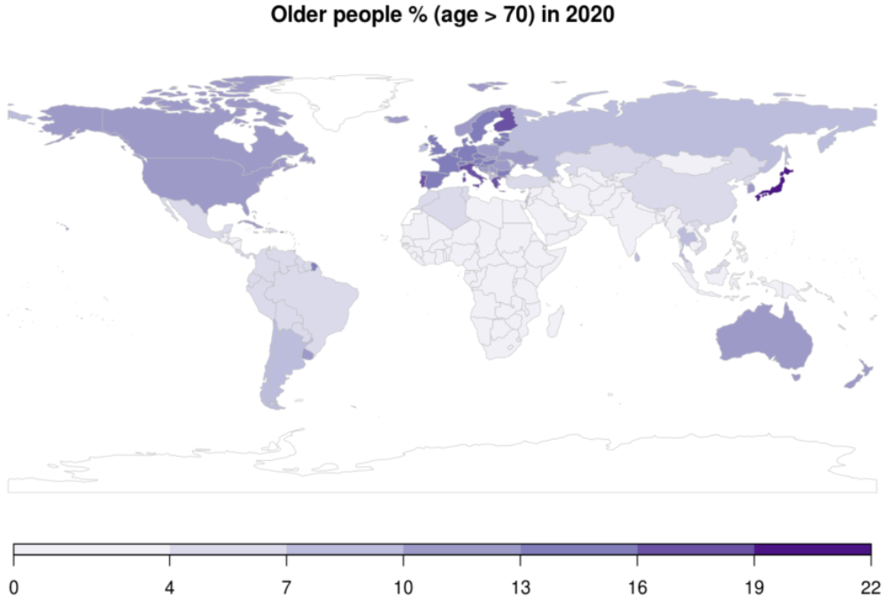

```{r setup, include=FALSE}
knitr::opts_chunk$set(echo = TRUE)
```

# Demographic theory and COVID-19

## Outline

  - Formal demography of epidemic mortality

## Motivating questions 

  1. How does **age-structure** of population affect epidemic mortality?
  2. How does mortality change affect **life expectancy** in normal
    times? 
  3. How much **remaining life is lost** from an epidemic?


## Population aging


  Source: Tuljapurkar and Zuo \url{https://u.demog.berkeley.edu/~josh/demogblog/}

  - Covid19 has affected the elderly the most which accounts for a substantial share of the population of the Global North. 
  
### Stable theory

Let's revist the stable population theory to understand a change the importance of population structure on epidemic dynamics. The underlying assumptions to a stable population are that i) age-specific mortality and fertility rates are fixed over a long period, ii) age-structure is constant and iii) population closed to migration. 

- In this context, the population of age $x$ in year $t$ depends on the births ($B(t)$) and the survivorship:  $$N(x,t)= B(t-x)\ell(x) =B(t)e^{-rx}\ell(x)$$. 
- The total population in year $t$ is then $N(t)=\int_{0}^{x} N(a,t)da = B(t)\int_{0}^{x} e^{-ra}\ell(a)da$
- Proportion of stable population at age x: 
$$ c(x) = \frac{N(x,t)}{N(t)}=\frac{B(t)e^{-rx}\ell(x)}{N(t)} =b e^{-rx}\ell(x) $$ where $b$ is the birth rate $\left(b=\frac{B(t)}{N(t)}\right)$. Note that the age-structure and the birth rate are independent of $t$ in the notation. 
- Birth rate of a stable population:
As $\int_0^{x} c(a)da =1$, $$\int_{0}^{x} b e^{-ra}\ell(a)da =1  \\ b = \frac{1}{\int_{0}^{x} e^{-ra}\ell(a)da} $$
Using the Lotka-Euler equation we find that:
$$ $$


- Now we look at the crude death rate (CDR), which is the share of deaths $D(t)$ in a given population
  $$\begin{aligned}
  CDR &= \frac{D(t)}{N(t)}\\ 
  & = \frac{\int_{0}^{x} D(a,t)da}{\int_{0}^{x} N(a,t)da} \\ 
  
  & = \frac{\int_{0}^{x} h(a) N(a,t)da}{B(t)\int_{0}^{x} e^{-ra}\ell(a)da}  \\ 
  &= \frac{B(t)\int_{0}^{x} h(a) e^{-ra}\ell(a)da}{B(t)\int_{0}^{x} e^{-ra}\ell(a)da}  
  \end{aligned}$$  where $h(x)$ is the hazard of dying at age $x$.
- Therefore, in a stable population with growth rate $r$ we have a crude death rate that depends on the intrinsic growth rate: 
  $$CDR(r) = {\int e^{-ra} \ell(a) h(a) \, da \over \int e^{-ra} \ell(a)  \, da} $$
  
- **How does the CDR vary with growth rates?**  
   We can change $r=b-d$ to make the population younger or older: $r>0 \Rightarrow$ younger population as $b>d$ but if $r<0 \Rightarrow$ then the population is older
$$ \begin{aligned}
\frac{d}{dr} \log CDR(r) &= \frac{d }{dr}\log \int e^{-ra} \ell(a) h(a) da - \frac{d}{dr}\log \int e^{-ra} \ell(a)da\\ 
& =  -\frac{\int a e^{-ra} \ell(a) h(a) da}{\int e^{-ra} \ell(a) h(a) da} + \frac{\int a e^{-ra} \ell(a)  da}{\int e^{-ra} \ell(a) da} \\
\end{aligned}$$  
   If we assume a stationary population, such that $r=0$,
$$ \begin{aligned}
\frac{d}{dr} \log CDR(r) & = -\frac{\int a \ell(a) h(a) da}{\int \ell(a) h(a) da} + \frac{\int a  \ell(a)  da}{\int  \ell(a) da} \\
& =-\frac{\int a D(a) da}{\int D(a) da} + \frac{\int a  \ell(a)  da}{\int  \ell(a) da} \\
& = -\int a D(a) da + \frac{\int a  \ell(a)  da}{\int  \ell(a) da}
\end{aligned}
$$
Here, $l(x)h(x)$ is the density of deaths  by age $x$ and $\int_0^x D(a)da =1$. This is a classic result (from Lotka) where the rate at which $r$ changes affects the CDR through the mean age ($A$) and the life expectancy at birth ($e_0$):
  $${d \log CDR(r) \over dr}|_{r = 0} = A - e(0)$$
  

    - An example: 
    Let  $A=40$ and $e_0=80$ then ${d \log CDR(r) \over dr}|_{r = 0}\approx -40$
    If US and India had same age-specific mortality, but India grew 1 percent faster, what would the ratio of their crude death rates be?
    Both countries experience the same CDR(r) but for India $dr=0.01$:
    $d \log CDR(r) = (-40)(0.01) = -0.4$
    The death rate will be 40% lower in the US relative to India conditional on age structure 
    **NOTE FOR JOSH: Not sure of interpretation of this example.**
    
    - Now, if Covid-19 increases hazards at all ages by the same amount proportion in both countries, what will the ratio of their crude death rates be?
     4 deaths in India per 10 deaths in the US. 


## Keyfitz's entropy

  - Assume that  there is a proportional difference in mortality rates across all ages such that:
  $$\mu^*(x) = (1 + \Delta) \mu_0(x)$$ where $\delta \in (0,1]$. 
  - The new survivoship is: 
  
  $$ \begin{aligned}
  \ell^*(x) &= e^{-\int_0^{x}\mu^{*}(a)da}\\
  & = e^{-(1+\Delta)\int_0^{x}\mu(a)da} \\
  & =\ell(x)^{1+ \Delta} 
  \end{aligned}$$
  
  - So, $H^*(x) = (1 + \Delta) H(x)$.
  - Life expectancy at birth is: 
  
  $$e_0^{*} (x) = \int_{0}^x \ell(a)^{1+\Delta}da$$
  
  - How does the new life expectancy change with the increase in mortality at al ages?
  
  $$ \frac{de_0^{*} (x)}{d\Delta} = \int_{0}^x (\log\ell(a))\ell(a)^{1+\Delta}da$$
  This quantity will never be positive, as $\ell(a) \leq 1$ such that $\log(\ell(a))<0$. As the $\Delta$ factor increases, life expectancy at birth falls. 
  

  - Entropy is defined as 
  
  $$
  {\cal H} = {d \log e_{0}(0) \over d \Delta} = {-\int \ell(x) \log \ell(x) \, dx \over e_{0}(0)}
  $$
  Reverse order of integration to get $$
  {\cal H} = {\int d(x) e(x) \, dx \over e_{0}(0)}
  $$ **NOTE TO JOSH**: don't really know what the last formula is supposed to convey.


## Loss of person years remaining
  Before epidemic the person year remaining (PYR):
  $$
  PYR = \int N(x) e(x) \, dx
  $$
  After (''instant'') epidemic 
  $$
  PYR = \int \left[ N(x) - D^*(x) \right] e(x) \, dx
  $$
  Proportion of person years lost
  $$
  \int D^*(x) e(x) \,dx \over \int N(x) e(x)\, dx
  $$

##  Stationary theory
  **If**
  
  1. $\color{red}{\mbox {Stationarity}}\, N(x) \propto \ell(x)$
  2. $\color{red}{\mbox {Proportional hazards}}\, M^*(x) = (1 + \Delta) M(x)$

  **Then**
    Proportional loss of person years:
    $$
    \color{red}{  {-d \log PYR \over d \Delta} = {H \over  A} = {\mbox{Life
          table entropy} \over \mbox{Mean age of stationary pop}}} \approx {0.15
      \over 40} = 0.0038
    $$

  A doubling of mortality in epidemic year ($\Delta = 1)$ causes ``only'' a 0.38\% loss of remaining life expectancy. % Average person who dies loses $e^\dagger \approx 12$ years.

  These numbers seem small, but:
  
  - Even an epidemic *doubling* mortality has small effect on
    remaining life expectancy ($\approx \color{red}{2 \mbox{ months}}$ per person)
  - But all-cause mortality also small 
    ($\approx \color{red}{2 \mbox{ months}}$ per person)
  - Covid-19: 1 million deaths $= 30$\% more mortality, but older \\
    ($\approx \color{red}{2 \mbox{ weeks}}$  per person)
  
 
