# Student Presentations
## Mortality Crossovers

### Outline
- Paper presentations
  - @coale1986mortality
  - @manton1981methods
- Empirical examples of crossovers with CenSoc data
- Investigate quality of age of death reporting in CenSoc

### _Mortality Crossovers: Reality or Bad Data?_ [@coale1986mortality]
They noticed the following patterns in the age-specific death rates for different countries. 

```{r crossover, fig.cap='Age specific death rates for different countries and cohorts. Source: @coale1986mortality', out.width='80%', fig.align='center',  echo=FALSE}
    knitr::include_graphics('figures/crossover_1.png')
    ```   
    

- Selection / heterogeneity:
  - Elimination of the frailer members of the population at younger ages leaves only the very robust with lower mortality rates.
- Level playing fields at older ages
  - Social Security, Medicare, etc.
- Bad data
  - Misreporting age of death can lead to biased estimates of mortality rates at older ages


#### Age heaping:
- General pattern of age misstatement, most often rounding up to nearest 5 or 10.
- Begins with a modest upward transfer at age 60 or 70, increases rapidly with age.

```{r crossover2, fig.cap='Age heaping example Source: IPUMS International', out.width='80%', fig.align='center',  echo=FALSE}
    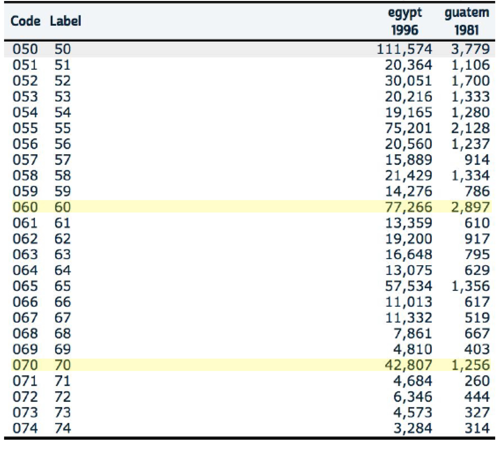
    ```  

  Implications of age heaping:
  
  $\text{age heaping on age 70} = \frac{Pop_{70}}{(Pop_{69}+Pop_{71})/2}$
  
```{r crossover3, fig.cap='Age heaping. Source: @coale1986mortality', out.width='80%', fig.align='center',  echo=FALSE}
    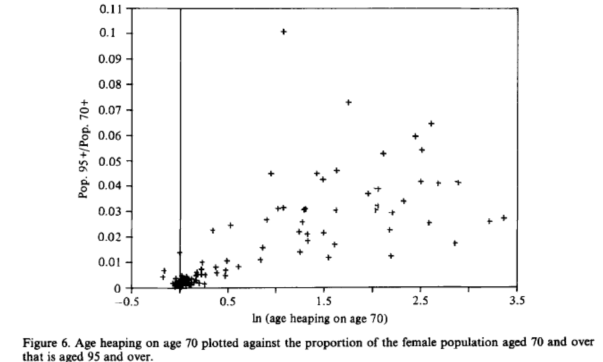
    ```

#### Takeaways
- Age overstatement at advanced ages is common and downwardly biases estimates of mortality rates
- Age heaping is associated with age overstatement
- Low quality mortality data can artificially create a mortality crossover


### _Methods for Evaluating the Heterogeneity of Aging Processes in Human Populations Using Vital Statistics Data: Explaining the Black/White Mortality Crossover by a Model of Mortality Selection_ [@manton1981methods]

#### Summary
- A model to compute the ratio of Black and White individual age specific mortality risks (within sex) to determine if the adjustments of heterogeneity and mortality selection is sufficient to remove the crossover.
- Data from the U.S. Black and White populations for the period 1935 to 1975.
- Mortality crossover (Blacks having relatively lower mortality rates) at age 75.
- Could be explained under the proposed model.
- Data quality? Variety of evidence supporting the existence of a crossover.
- Consequently, careful consideration should be made of the population
mechanisms by which the crossover might occur.

#### A model of selection
- Life tables are separately calculated for the Black and White populations in the U.S. over the period 1935 to 1975 based upon the assumptions:
  - Each population is heterogeneous.
  - The initial distribution of individuals in each population is identical (within sex) with respect to variables relevant to longevity.
  -Individual's environmental conditions are fixed at birth.
- Operationally, they modified standard life table calculations (Chiang, 1968) to reflect the dependence of mortality rates at advanced ages upon the selection of earlier mortality levels on a heterogeneous population.

#### A little bit of math
- Assumptions:
  - The following partial differential equation governs the change of the distribution as cohort age:
  $$\begin{aligned}
  \frac{\partial f_{x}(z)}{\partial x}= f_{x}(z)(\bar{\mu}_{x}-\mu_{x}(z))
  \end{aligned}$$
  - Each person retains the value of $z$ (longevity characteristics) given at birth.
  - Functional forms: 
  $$\begin{aligned}
  \mu_{x}(z)=z\mu_{x}(1)= z\mu_{x}
  \end{aligned}$$
  - Thus $z$ may be taken to be a measure of relative (to the standard individual) frailty or "susceptibility to death". Alternatively, $1/z$ may be considered as a measure of vitality or "robustness".
- Variance and frailty relation:
  - We also have the following definitions:
  $$\begin{aligned}
  \overline{\mu}_x&= \overline{z}\mu_x\\
  \overline{z}_x&= \int_0^\infty z f_x(z) dz
  \end{aligned}$$
  - Therefore, we can say that $\frac{\partial\overline{z}_x}{\partial x}=- \mu_x \sigma_x^2(z)$
  $$\begin{aligned}
  \frac{\partial f_x(z)}{\partial x}&=f_x(z)(\overline{z}\mu_x - z\mu_x)\\
  \frac{\partial\overline{z}_x}{\partial x}&= \frac{\partial \int z f_x(z) dz}{\partial x}\\
  &= \int z \frac{\partial f_x(z) }{\partial x}dz\\
  &= \int z f_x(z)(\overline{z}\mu_x - z\mu_x)dz \\
  &= \mu_x \left(\int z f_x(z)\overline{z} dz-  \int z^2 f_x(z)dz\right)\\
  &= -\mu_x \left(\int z^2 f_x(z)dz - \overline{z} \int z f_x(z) dz  \right)\\
  &= -\mu_x \left(\int z^2 f_x(z)dz - \overline{z}^2  \right)\\
  \frac{\partial\overline{z}_x}{\partial x}&=  - \mu_x \sigma_x^2(z)
  \end{aligned}$$
  - This means the "frailer" population members (with high z's) are being selected earlier than their more "robust" contemporaries (with low z's)
- Gamma distribution:
  - The proportionality assumption has implications for $f_x(z)$
      - Mortality cannot be negative, then z must be positive.
      - Average endowment, $\overline{z}_0$, for longevity, it follows that $\overline{\mu}_0=\mu_0$. Hence, $\overline{z}_0=1$
      - It would be desirable that the paramteres of $f_x$ be unchanged for any $x$.
  $$\begin{aligned}
  f_x(z)=z^{k-1}\lambda_x^k exp(-z\lambda_x)/\Gamma(K)
  \end{aligned}$$
        - With mean $\overline{z}_x=k/\lambda_x$ and variance:
  $$\begin{aligned}
  \sigma_x^2(z) = \overline{z}^2_x/k = k/\lambda^2
  \end{aligned}$$
- ASPD and the relative risk:
  - From the variance of the gamma, the average mortality and the definition of $\overline{s}_x$, we have:
  $$\begin{aligned}
\sigma_x^2(z)&= \overline{z}^2_x/k\\
\overline{\mu}_x&= \overline{z}_x\mu_x\\
\overline{s}_x&= exp\left(-\int_0^x \overline{\mu}_t dt\right)\\
nq_x(z) &= 1-exp\left(\frac{kz}{\overline{s}_x^{1/k}}-\frac{kz}{\overline{s}_{x+n}^{1/k}}\right)\\
\overline{r}_x&= \frac{\mu_{x1}}{\mu_{x2}}\left(\frac{\overline{s}_{x1}}{\overline{s}_{x2}}\right)^{1/k}
  \end{aligned}$$

#### Parameter k
- Select values of k focus upon the biological rather than statistical
  a. Biological dimensions underlying longevity are normally distributed at birth.
  b. Any deviation from an "optimal" biological point will be associated with decreased survival.
  c. Conditionally on age, mortality will be a quadratic function
  d. Each individual's endowment for longevity (z) is fixed at birth.
- The value of к is the result of n, number of dimensions relevant to longevity.
- The relation of n to the gamma shape parameter is simply n=2k.
- Lower n, the greater is the heterogeneity (higher variance of gamma)
- The values of n used are 1 and 2, suggesting that longevity is unidimensional (k=0.5) and bidimensional (k=1), respectively.

```{r crossover4, fig.cap='Cohort and Individual Age Specific Mortality Probabilities for the 1875 White Female Birth Cohort. Source: @manton1981methods', out.width='80%', fig.align='center',  echo=FALSE}
    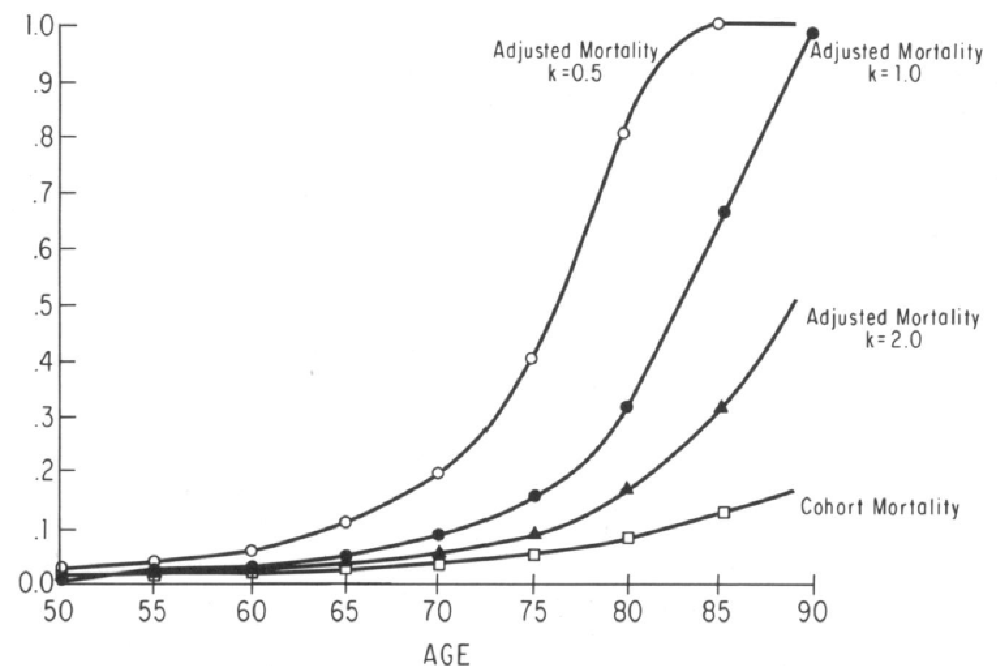
```  
```{r crossover5, fig.cap='Age-specific mortality risk ratios (Black males vs White males) for the years 1935,1955 and 1975. Source: @manton1981methods', out.width='80%', fig.align='center',  echo=FALSE}
    knitr::include_graphics('figures/crossover_5.png')
```  
```{r crossover6, fig.cap='Age-specific mortality risk ratios (Black females vs White females) for the years 1935,1955 and 1975. Source: @manton1981methods', out.width='80%', fig.align='center',  echo=FALSE}
    knitr::include_graphics('figures/crossover_6.png')
```  

#### Takeaways

  - It seems that the crossover at advanced ages for males is an artifact of the early differential mortality selection.
  - An explanation for this differentials at older ages is the relatively more rapid reduction in individual white male mortality
  - For black females we can see that they were worse off than males between 25-45 (the childbearing years) at 1935.
  - Different Zs will result in a divergence between the increase with age of the cohort mortality rates and the age increase in the probabilities of death for individuals within the cohort.
  - This because the earlier selection of the less "robust" population members, implies that individuals age "faster" than their cohorts.
  
### CenSoc Mortality Crossovers
```{r crossover7, fig.cap='Pooled cohorts of 1890-1900', out.width='80%', fig.align='center',  echo=FALSE}
    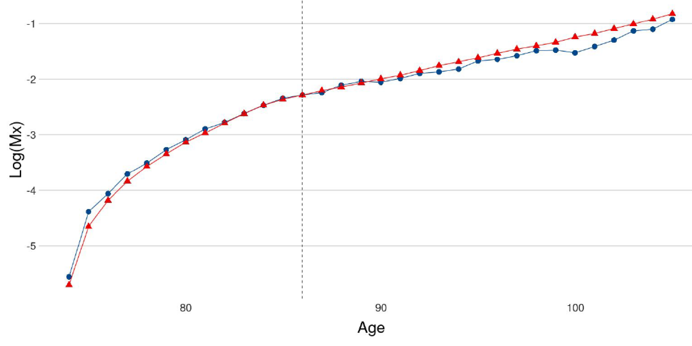
```  

```{r crossover8, fig.cap='Pooled cohorts of 1890-1900, by education level', out.width='80%', fig.align='center',  echo=FALSE}
    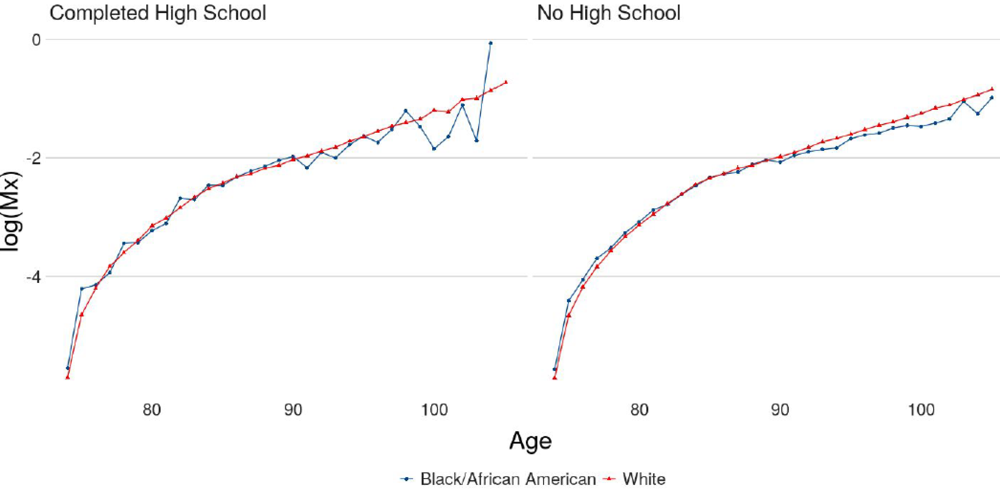
```  
  
```{r crossover9, fig.cap='Pooled cohorts of 1890-1900 by location', out.width='80%', fig.align='center',  echo=FALSE}
    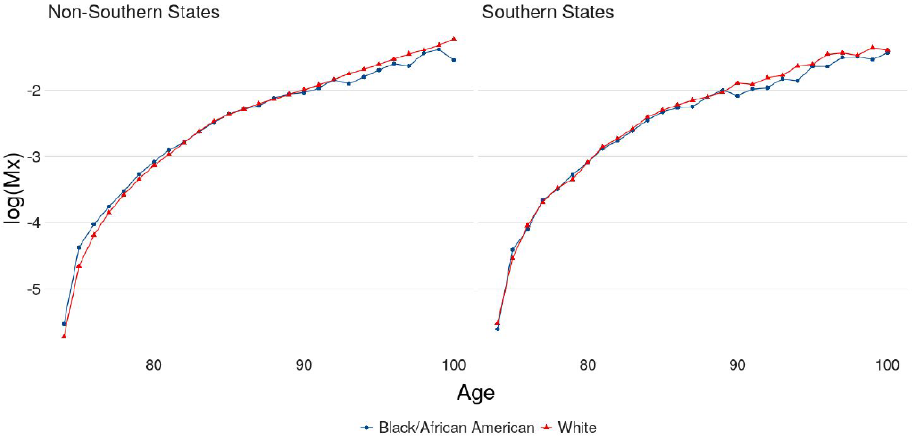
```  

```{r crossover10, fig.cap='Pooled cohorts of 1890-1900 by wages', out.width='80%', fig.align='center',  echo=FALSE}
    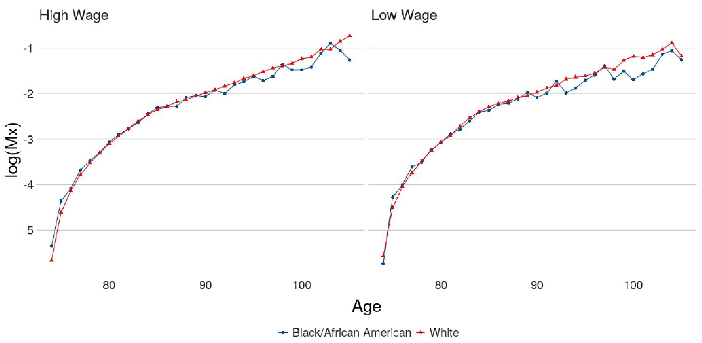
```  
#### Can the crossover be eliminated?

The baseline hazard is given by  $\mu_{0}(x)=\bar{\mu}(x)e^{\sigma^{2}\bar{H}(x)}$ and we try different values of $\sigma^2$ for each group of people, in this case Black and White. 

```{r crossover11, fig.cap='Pooled cohorts of 1890-1900 by wages', out.width='80%', fig.align='center',  echo=FALSE}
    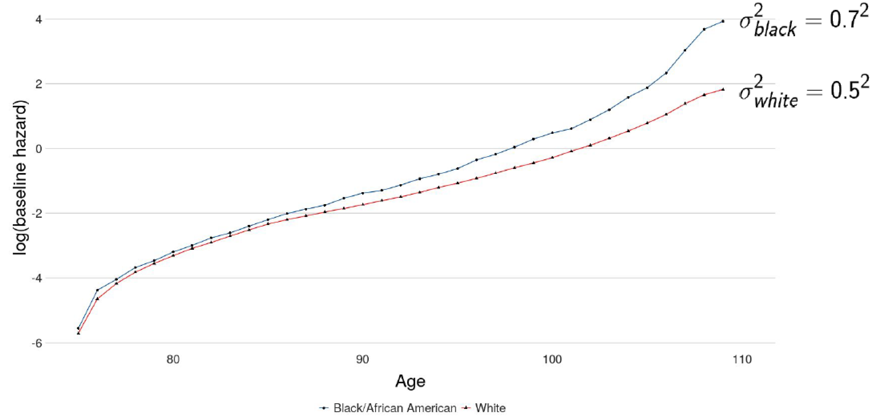
```  

#### Is death data in CenSoc file less reliable for Blacks?

  - 57% of black people in pooled 1890-1900 cohort are missing death
days (day of the month)
  - 51% of white people missing death days
  - No missing death months
  - Missing day of birth far less common (about 0.005% of records)
  - Are missing dates indicative of poor data?

```{r crossover12, fig.cap='Day of death', out.width='80%', fig.align='center',  echo=FALSE}
    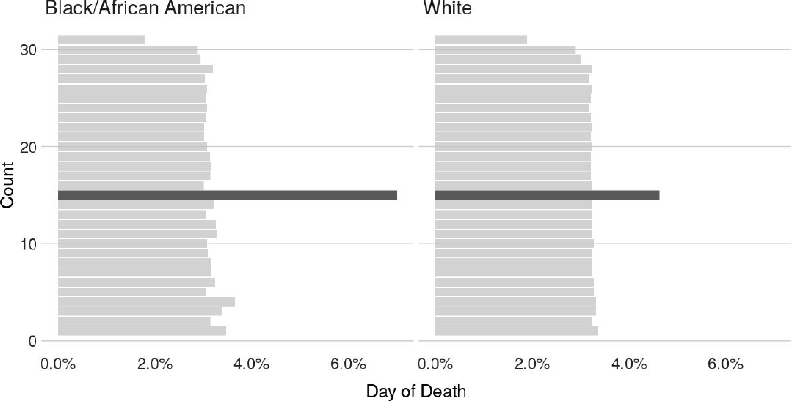
```  

```{r crossover13, fig.cap='Month of death', out.width='80%', fig.align='center',  echo=FALSE}
    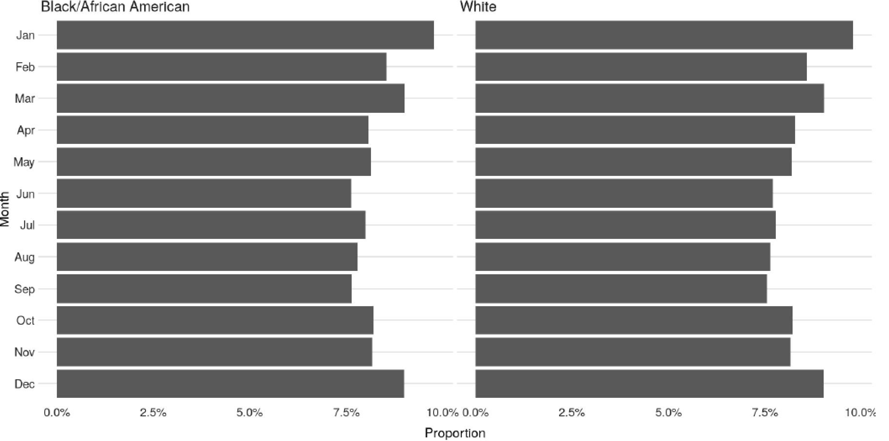
```  

If observations with missing dates are dropped then the mortality rates look slightly different.

```{r crossover14, fig.cap='Mortality crossover for pooled cohorts of 1890-1900.', out.width='80%', fig.align='center',  echo=FALSE}
    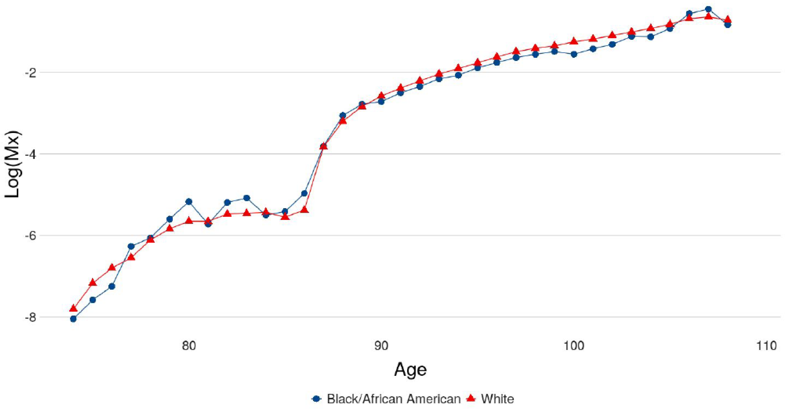
```  

#### Heaping for reported birth year

  - No Heaping on Death Year
  - No Heaping on Age of Death
  - Heaping on Birth Year
  
$Heaping(1900)=\frac{B_{1900}}{(B_{1899}+B_{1901})/2}$

```{r crossover15, fig.cap='Heaping: birth year', out.width='80%', fig.align='center',  echo=FALSE}
    knitr::include_graphics('figures/crossover_15.png')
```  


## Plateaus
- @steinsaltz2006understanding
- @barbi2018: Recent paper claiming to be “the best evidence to date for the existence of extreme-age mortality plateaus in humans”

Using total mortality rates for italian cohorts from 1900 to 1926 (from HMD), we can look at mortality rates over ages and cohorts, as an introduction to @barbi2018. When focusing on mortality rates above age 60, we see a constantly increasing curve with some variation at very old ages (beyond 100). One important limitation of our life tables is that the rates are only observed up until age 109.

```{r, message=FALSE, warning=FALSE}
library(tidyverse)

it <- read_table("data/ITA.bltcoh_1x1.txt", skip=1)
it$Age <- as.numeric(it$Age)
it$mx <- as.numeric(it$mx)
it$qx <- as.numeric(it$qx)
it <- it %>% mutate(mx = if_else(mx == 0, as.numeric(NA), mx))

```
```{r plateau1, fig.cap='Log mortality rates above age 60 after 1900', out.width='80%', fig.align='center',  echo=FALSE}
ggplot(it %>% filter(Age > 60, Year > 1900)) + 
  geom_line(aes(x = Age, y = log(mx), color = as.factor(Year))) + 
  theme_minimal()+
 ylab(expression(log(m[x])))+
  labs(color= "Year")

```

To detect plateaus above age 105 like the paper, we estimate a Gompertz on ages 60- 100 (there's some noise from the war) after 1900. Recall that to estimate mortality using hazard rates for Gompertz: 
\begin{aligned*}
h(x) = a e^{b*x} \\
log(h{_x}) = log(a) + b\times x
\end{aligned*}
Since we don't have $h(x)$ from the lifetable, we use ${_1}m_x$

```{r, message=FALSE, warning=FALSE}
min_gomp_age <- 60
max_gomp_age <- 105
max_plateau_age <- 109
min_year <- 1900 

gomp <- lm(log(mx) ~ Age, data = it %>% filter(Age > min_gomp_age & Age < max_gomp_age & Year > min_year))
new <- data.frame(Age = max_gomp_age:max_plateau_age)
new$Gomp.pred <- exp(predict(gomp, new))
new <- new %>% left_join(it %>% filter(Age > max_gomp_age-1, Year > min_year) %>% select(Age, Year,mx) %>% spread(Year, mx))
new <- new %>% gather("Year", "mx", -Age)
```
It seems that the Gompertz prediction is in line with the data, at least in its trend. However, note the variation in rates between every cohort. 
```{r plateau2, fig.cap='Predicted log mortality rates above age 104 after 1900', out.width='80%', fig.align='center',  echo=FALSE}
ggplot(new %>% filter(Year != "Gomp.pred")) + 
  geom_line(aes(Age, log(mx), color = Year)) + 
  geom_line(data = (new %>% filter(Year == "Gomp.pred")), aes(Age, log(mx) ), color = "black", size = 2) + 
  ggtitle("Gompertz prediction (black) ")+
  theme_minimal()+
  ylab(expression(log(m[x])))

```
 Now, we look at predicted mortality rates by gender. The graphs below show a similar trend as the previous graph for overall mortality rates. Although the predictions seem to fit the data, that is Gompertz is an adequate method to model mortality between the ages of 100 to 109, a plateau may appear for even later ages. Since HMD data uses ages up to 109, we are unable to observe a plateau as in @barbi2018.

```{r, message=FALSE, warning=FALSE}
# For men:
it_m <- read_table("data/ITA.mltcoh_1x1.txt", skip=1)
it_m$Age <- as.numeric(it_m$Age)
it_m$mx <- as.numeric(it_m$mx)
it_m$qx <- as.numeric(it_m$qx)
it_m <- it_m %>% mutate(mx = if_else(mx == 0, as.numeric(NA), mx))


gomp <- lm(log(mx) ~ Age, data = it_m %>% filter(Age > 60 & Age < 100 & Year > 1900))
new <- data.frame(Age = 101:109)
new$Gomp.pred <- exp(predict(gomp, new))
new <- new %>% left_join(it_m %>% filter(Age > 95, Year > 1900) %>% select(Age, Year,mx) %>% spread(Year, mx))
new <- new %>% gather("Year", "mx", -Age)

```

```{r plateau3, fig.cap='Log mortality rates for men above age 60 after 1900', out.width='80%', fig.align='center',  echo=FALSE, warning=FALSE}
ggplot(it_m %>% filter(Age > 60 & Year > 1900)) + 
  geom_line(aes(x = Age, y = log(mx), color = as.factor(Year)))+
  theme_minimal()+
 ylab(expression(log(m[x])))+
  labs(color= "Year")
```

```{r plateau4, fig.cap='Predicted log mortality rates for men above age 99 after 1900', out.width='80%', fig.align='center',  echo=FALSE, warning=FALSE}
ggplot(new %>% filter(Year != "Gomp.pred")) + 
  geom_line(aes(Age, log(mx), color = Year)) + 
  geom_line(data = new %>% filter(Year == "Gomp.pred"), aes(Age, log(mx) ), color = "black", size = 2) +
  ggtitle("Male: Gompertz Prediction (black)")

```

```{r, message=FALSE, warning=FALSE}
# Women
it_f <- read_table("data/ITA.fltcoh_1x1.txt", skip=1)
it_f$Age <- as.numeric(it_f$Age)
it_f$mx <- as.numeric(it_f$mx)
it_f$qx <- as.numeric(it_f$qx)
it_f <- it_f %>% mutate(mx = if_else(mx == 0, as.numeric(NA), mx))

gomp <- lm(log(mx) ~ Age, data = it_f %>% filter(Age > 45 & Age < 100 & Year > 1900))
new <- data.frame(Age = 101:109)
new$Gomp.pred <- exp(predict(gomp, new))
new <- new %>% left_join(it_f %>% filter(Age > 95, Year > 1900) %>% select(Age, Year,mx) %>% spread(Year, mx))
new <- new %>% gather("Year", "mx", -Age)
```

```{r plateau5, fig.cap='Log mortality rates for women above age 60 after 1900', out.width='80%', fig.align='center',  echo=FALSE, warning=FALSE}
ggplot(it_f %>% filter(Age > 60 & Year > 1900)) + 
  geom_line(aes(x = Age, y = log(mx), color = as.factor(Year))) +
  theme_minimal()+
  ylab(expression(log(m[x])))+
  labs(color= "Year")
```

```{r plateau6, fig.cap='Predicted log mortality rates for women above age 99 after 1900', out.width='80%', fig.align='center',  echo=FALSE, warning=FALSE}
ggplot(new %>% filter(Year != "Gomp.pred")) + 
  geom_line(aes(Age, log(mx), color = Year)) + 
  geom_line(data = new %>% filter(Year == "Gomp.pred"), aes(Age, log(mx) ), color = "black", size = 2) + 
  theme_minimal()+
  ggtitle("Female: Gompertz Prediction (Black) ")
```


## Rising Inequality

- @waldron2007trends: Age-cohort model suggesting growing inequality by income, but includes many caveats about heterogeneity. Our challenge is to apply models of heterogeneity to this issue, particularly the result on mortality improvement over time.

### _Trends in mortality differentials and life expectancy for male social security-covered workers, by socioeconomic status_ [@waldron2007trends]
  
  - This paper fits in nicely with our discussion of heterogeneity and different rates of improvement across groups
  - Analyzes trends in mortality differentials and life expectancy by average relative earnings for male Social Security-covered workers aged 60 or older
  - Finds differences in level and rate of change in mortality improvement over time by SES
      - "..male Social-Security covered workers born in 1941 who had average relative earnings in the top half of the earnings distribution and who lived to age 60 would be expected to live 5.8 more years than their counterparts in the bottom half. In contrast, among male Social Security-covered workers born in 1912 who survived to age 60, those in the top half of the earnings distribution would be expected to live only 1.2 years more than those in the bottom half.”
  - Warns that these projections are very much only one possible outcome, since the causes of the widening differentials observed are still not understood

#### Context and data

  - Historically, mortality inequalities by class that emerged between 1650-1850 began to narrow by the 1930s and 1940s (eg. Antonovsky 1967)
  - Evidence that the gap has widened due to differential rates of decline in deaths due to heart disease (Feldman 1989)
  - This paper adds to the literature by using a large longitudinal data set in which deaths are observed over 29 years
  - This allows for disaggregation by age and year-of-birth, avoiding linearity assumptions with regard to interaction terms
  - Wage data comes from the SSA Continuous Work History Sample, combined with the Numident (master death) file and the Master Beneficiary Record file
  - Earnings are measured relative to the national average wage in the year, then averaged
  - Earnings are only used post 1957 to account for expansion of Social Security coverage--some issues still exist due to subsequent expansions, but Waldron suggests that these should not have an important
  - Important caveat: this is not a representative sample, as it excludes men not participating in the labor force and does not account for the possibility of low covered earnings combined with high non-covered earnings

#### Methods

  - Estimates are constructed of mortality differentials and cohort and period life expectancies
  - Models:
    - Mortality differentials over time: 
      - $1(dead)_{isc}= \alpha +\beta_{1}age_{isc} + \beta_{2}1(earnings)_{isc}+\epsilon_{isc}$
    - Cohort life expectancy estimates:
      - Uses a discrete-time logistic regression model of the form
      - $1(dead)_{isc}= \gamma + \theta_{1}age_{isc}+ \theta_{2}birthyear_{isc} + \theta_{3}age_{isc}\times birthyear_{isc}+ \theta_{4}1(earnings)_{isc}+ \theta_{5}age_{isc}\times 1(earnings)_{isc}+ \theta_{6}birthyear_{isc}\times 1(earnings)_{isc}+ \theta_{7}age_{isc}\times birthyear_{isc}\times 1(earnings)_{isc}+\varepsilon_{isc}$
    - Does not control for changes in sample frailty over time: “Theoretically, if more frail members of lower-earnings groups are making it into the sample at older ages than in the past, then they could push up mortality differentials relative to the past. Hypothetically, it is possible that widening mortality differentials can indicate improvement for the lower-earnings groups, if such widening is an indication of their survival in greater numbers to ages at which previously only the strongest among them survived.”


#### Results

  - Widening mortality differentials: 
```{r progress1, fig.cap='Selected cohort survival curves for male Social Security-covered workers, by age and earnings group. Source: Chart 1 @waldron2007trends', out.width='80%', fig.align='center',  echo=FALSE}
    knitr::include_graphics('figures/progress_1.png')
```  
```{r progress2, fig.cap='Percentage change in the death rate for male Social Security-covered workers, by selected age and earnings group from birth years 1912-1941. Source: Chart 2 @waldron2007trends', out.width='80%', fig.align='center',  echo=FALSE}
    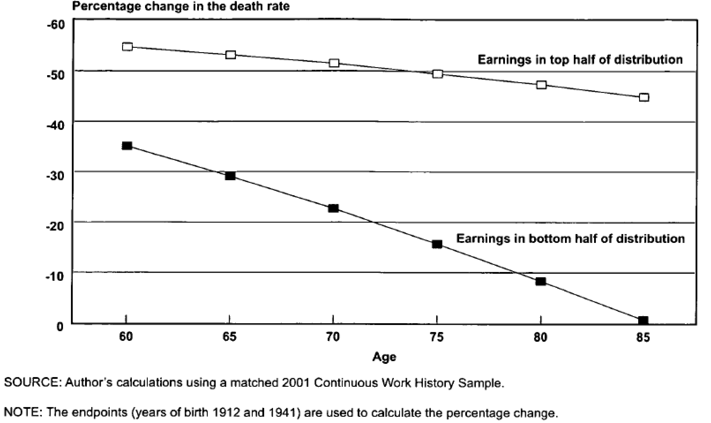
```  
```{r progress3, fig.cap='Cohort life expectancy at age 65 (and 95 percent confidence intervals) for male Social Security-covered workers, by selected birth years and earnings group. Source: Chart 3 @waldron2007trends', out.width='80%', fig.align='center',  echo=FALSE}
    
```  
  - These results also hold for cohort life expectancies, though for later birth cohorts the confidence intervals tend to overlap--projected estimates.
  - Waldron, using period data, also attempts to compare these numbers to other OECD countries, finding that, at 65, high-earning Social Security-covered men rank close to population averages for multiple other countries like Canada, suggesting they do worse than high-earning men in these countries
    - Men in the bottom quarter of the earning distribution “could expect to live roughly as long as the average Irishman”
    - Differences in medical care and health behaviors?
    - Short discussion of the differences in frailty across countries--Mexico is predicted to have a selectively healthier and more robust population at age 80
  - This paper offers insight into the way in which population heterogeneity may lead to very different outcomes--though questions about sample frailty remain.
  - A simulation of mortality differentials over time shows that:
    - Over time, for a given age, the differential has widened.
    - Within the same cohort, across ages, the differential falls.
  ```{r progress4, fig.cap='Odds ratio (confidence intervals) for the bottom half of the earnings distribution relative to the top half of the distribution, by year of birth and age. Source: Table 1 @waldron2007trends', out.width='80%', fig.align='center',  echo=FALSE}
    knitr::include_graphics('figures/progress_4.png')
```   
  - We can replicate the results of the simulation below. We want to see if heterogeneity alone can explain the pattern in
Waldron's observations of hazard ratios declining by age and increasing from one cohort to the next. The key idea is that moving from one cohort to the next, holding age constant, is like moving to younger ages within a cohort. Just as moving to younger ages makes the observed hazard ratio larger, moving to a lower baseline mortality rate, holding age constant,
also makes the hazard ratio larger. 
```{r}
 ## Waldron Simulation using Gamma-Gompertz
t <- 1:5 ## five different cohrots (say each 10 years apart)
k <- .25 ## amount of mortality decline per decade (about 2.5% per year)
b <- .1 ## gompertz slope
a0 <- 10^{-3} ## starting hazard (rather high)
a0.vec <- a0 * exp(-k * t) #hazard vector for every cohort, including a mortality decline
x <- 0:100

# mu.bar <- a * exp(b * x) / (1 + (a * s2 / b) * (exp(b*x) - 1)) #gamma gompertz formula, where s2 is sigma^2
mu.1.bar.xt <- matrix(NA, length(t), length(x)) # matrix of cohorts (rows) by ages (columns)
mu.2.bar.xt <- matrix(NA, length(t), length(x))
dimnames(mu.1.bar.xt) <- list(t, x)
dimnames(mu.2.bar.xt) <- list(t, x)
s2 <- .2

for (i in 1:length(t)) #i: cohort counter
{
    a1 <- a0.vec[i]
    a2 <- a1 * 2                           
    mu.1.bar.xt[i,] <- a1 * exp(b * x) /
        (1 + (a1 * s2 / b) * (exp(b*x) - 1)) # baseline hazard
    mu.2.bar.xt[i,] <- a2 * exp(b * x) /
        (1 + (a2 * s2 / b) * (exp(b*x) - 1)) # population hazard
}

R.mat <- mu.2.bar.xt/mu.1.bar.xt #odds ratio

waldron.simu <- R.mat[, x %in% seq(60, 100, 10)]
print(waldron.simu)
```
  - Interestingly, you can see that after 5 decades, the $R(x)$ curve has shifted over almost exactly 10 years. R(90, decade 1) nearly equals R(100, decade 5) and similarly for age 60, 70, and 80.
  - We now block the lower right cells (so that our table looks like Waldron's):
    ```{r, echo=FALSE}
waldron.upper <- waldron.simu
waldron.upper[2,5] <- NA
waldron.upper[3,4:5] <- NA
waldron.upper[4,3:5] <- NA
waldron.upper[5,2:5] <- NA

print(round(waldron.upper,2))
```
  - We see a more rapid decline by age, and a less rapid increase by cohort. But qualitatively the pattern looks similar.
  - Further investigation could try to choose more accurate $a0$ and $b$ parameters to match better with observed mortality rates. Note: the true risk of being in group 2 instead of 1 is R = 2. So it's not that by cohort 5 we're seeing a distortion of the R(60). Rather we're seeing convergence of the population value to the individual risk.


