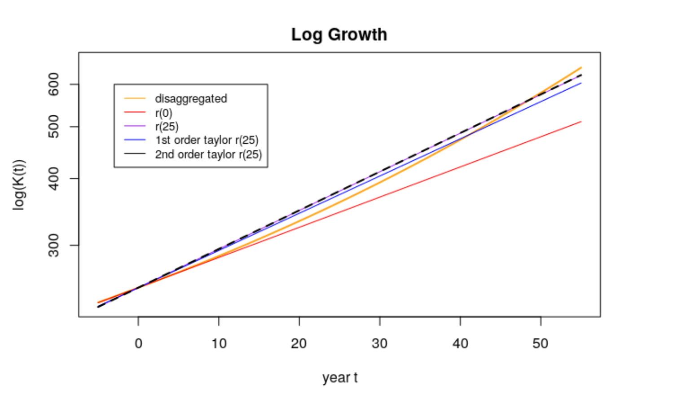
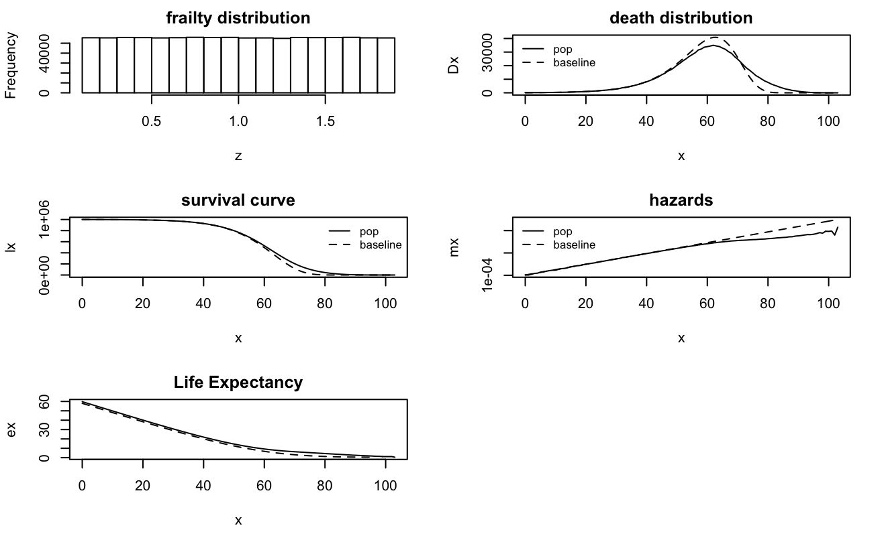
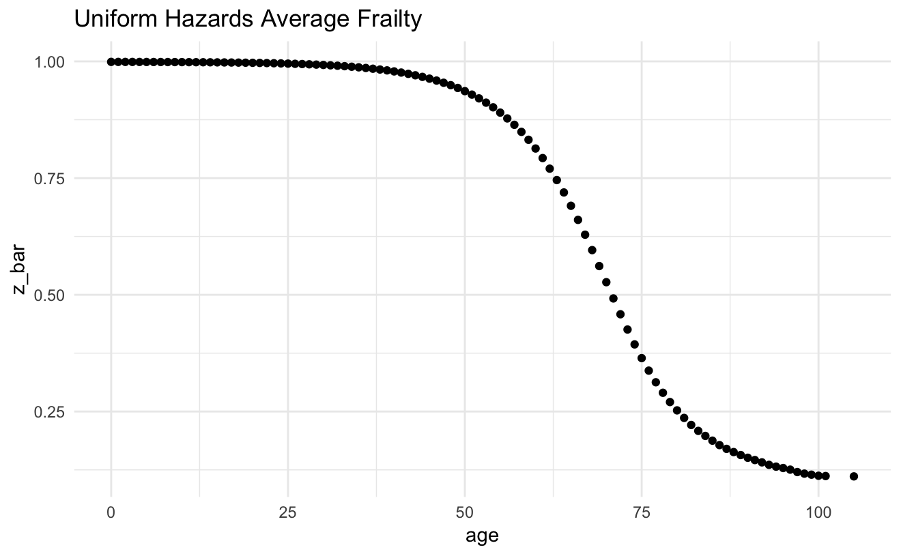
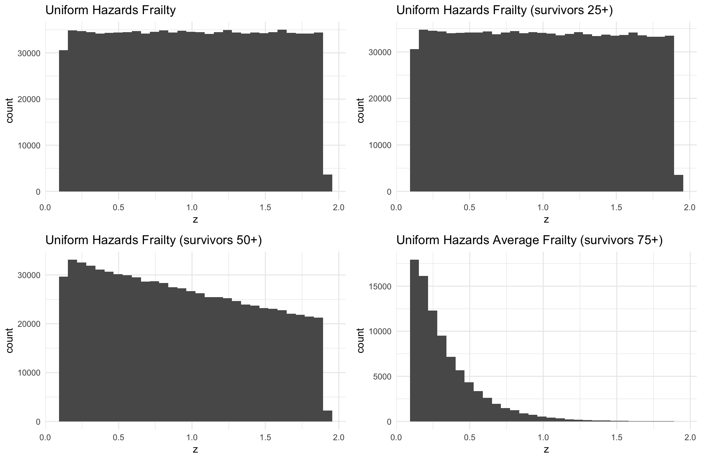
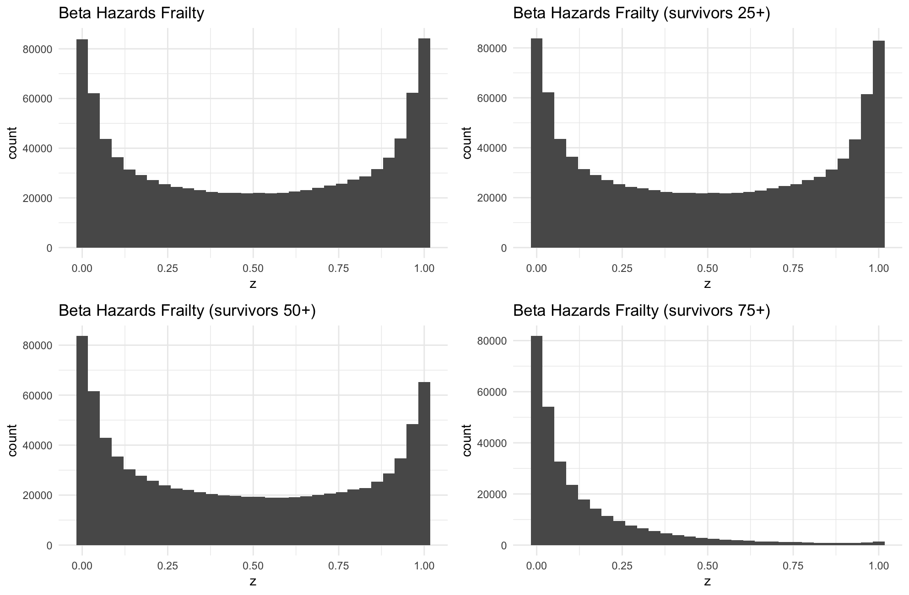
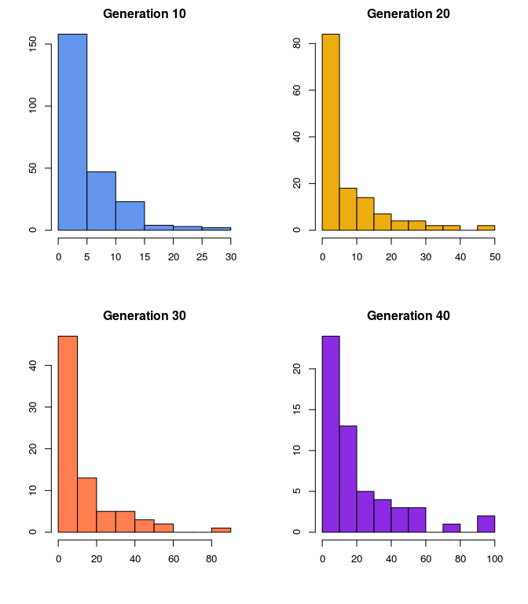

--- 
title: "A Minimal Book Example"
author: "Yihui Xie"
date: "`r Sys.Date()`"
site: bookdown::bookdown_site
output: bookdown::gitbook
documentclass: book
bibliography: [book.bib, packages.bib]
biblio-style: apalike
link-citations: yes
github-repo: rstudio/bookdown-demo
description: "This is a minimal example of using the bookdown package to write a book. The output format for this example is bookdown::gitbook."
fig_caption: true
---

# Prerequisites

Special thank you to the Spring 2020 Mathematical Demography students for the problem set answers. 


```{r eval=FALSE}
install.packages("bookdown")
# or the development version
# devtools::install_github("rstudio/bookdown")
```


<!--chapter:end:index.Rmd-->

# Problem set 1

## Questions

1. True or False? “If every part grows exponentially at its own rate, then the whole will also grow exponentially.” Explain your answer briefly.

2. List what you think are two of the best arguments in favor of doing a disaggregated projection? What are two of the best arguments in favor of doing an aggregated projection?
3.  $r_u = .0075$, $r_m = 0.035$, $K_u(1970) = 200$, $K_m(1970) = 50$
    (@) Use the first few years of the projection to verify that rate of change in the aggregate growth rate equals the variance of the growth rate. Does it matter what time points and period you consider?  
    (@) The growth rate changes over the course of the 50 years, but there is a constant growth rate that will produce the exact same population after 50 years. A reasonable choice of the constant growth rate to apply is the value of the changing growth rate at year 25 (half-way through the period). We can estimate this using a Taylor series approximation: $$ \bar{r}(25) \approx \bar{r}(0) + 25\bar{r}'(0) + (25)^2 \bar{r}''(0) $$  
        i. Show that $\bar{r}''(t) = \bar{r}_3(t) - \bar{r}_2(t) \bar{r}(t) - 2 \bar{r}(t) \sigma^2_r(t)$ \\
        ii. Calculate the combined US-Mexico population after 50 years according to the following five (5) methods, plot the total population after 50 years according to these 5 methods on a graph.
            a. Dissaggregated (“true”) forecast, with each country growing at its own rate
            b. Aggregated forecast, pretending it’s one country, growing at $\bar{r}(0)$) for 50 years
            c. Aggregated forecast, growing at the “true” value of $\bar{r}(25)$ for the whole period. (Use the value of $\bar{r}(25)$) that you calculate from the disaggregated forecast):
            d. Aggregated forecast, growing at the first-order Taylor series estimate of $\bar{r}(25)$ for the whole period:
            e. Aggregated forecast, growing at the second-order Taylor series estimate of $\bar{r}(25)$ for the whole period:
            For this exercise we need to calculate the extra second-order term from the Taylor series, $25^2\bar{r}''(0)$:

   4. For Ken’s Poisson-Exponential model,
      a. What is the closed-form expression for $\hat{r}(t)$  
      b. What is the variance of the growth rate?  
      c. Write down an expression for the distortion index. What variables and parameters in the model does it depend on? Are there any variables or parameters that it doesn’t depend on? (difference of $\bar{r}(t)$ and $\bar{r}(0)$)  

## Solutions
1. True or False? “If every part grows exponentially at its own rate, then the whole will also grow exponentially.” Explain your answer briefly.

   False. 

   From Keyfitz we know that the average growth rate of a heterogeneous population is: $$\bar{r}(t)=\frac{\sum_i{Q_i}{r_i}e^{r_i{t}}}{\sum_i{Q_i}e^{r_i{t}}}$$ Here, $\bar{r}(t)$ is not constant for all t as  there is a compositional effect. This should be read as “If every part grows at a constant exponential rate, then the whole will also grow exponentially.”.
We could argue that only in the long term it is true. 


2. List what you think are two of the best arguments in favor of doing a disaggregated projection? What are two of the best arguments in favor of doing an aggregated projection?
    a. Disaggregated projections:
        i. Revealing the "true" path, patterns of individuals different from that of the aggregate.
        ii. Take into account size of each sub-population, in particular the smaller ones.
        iii. It may be more precise. Growth rates for sub-populations reflect their intrinsic characteristics, such that projections that do not use appropriate rates can lead to adverse social/policy implications. 
    b. Aggregated projections:
        i. If population is homogeneous, we can estimate a simpler model than projecting many models for sub-populations.
        ii. We might care more about the overall rates rather than the group-specific rates.
        iii. More data available.
        iv. Easier.

3.  $r_u = .0075$, $r_m = 0.035$, $K_u(1970) = 200$, $K_m(1970) = 50$
    (@) Use the first few years of the projection to verify that rate of change in the aggregate growth rate equals the variance of the growth rate. Does it matter what time points and period you consider?  
    From the information given, we can obtain $\bar{r}(t)$ and $\sigma_r^2(t)$ by projecting each country's population using individual rates and then obtaining the total population ($\bar{K}(t)$). We use the formula for aggregate growth rate: $$ \bar{r}(t)= \frac{K_u(0) r_u(t) e^{r_u(t) t} + K_m(0) r_m(t) e^{r_m(t) t}}{K_u(0) e^{r_u(t) t} + K_m(0) e^{r_m (t) t}}$$
    Then, we can calculate the variance of the growth rates as: 
    $$\begin{aligned}
    \sigma_r^2(t) &= \frac{{K_u(0) e^{r_u(t) t}(r_u(t) - \bar{r}(t))^2 + K_m(0) e^{r_m(t) t}(r_m(t) - \bar{r}(t))^2}} { {K_u(0) e^{r_u(t) t} + K_m(0) e^{r_m(t) t}}} \\ 
    &= \frac{K_u(t) r_u(t)^2 + K_m(t) r_u(t)^2}{K_u(t)+K_m(t)}-\bar{r}(t)^2 
    \end{aligned}$$
    The table below show these results for projections at the beginning and ending of a 50 year period. 
    ```
    | $t$ | $\sigma^2_r(t)$ | $K_u(t)$ | $K_m(t)$ | $\bar{K}(t)$ | $\bar{K}(t)-\bar{K}(t-1)$ | $\bar{r}(t)$ | $\bar{r}'(t)$ |
    |---|---------------|--------|--------|------------|-------------------------|------------|-------------|
    |0  | 0.00021     | 200     | 50      | 250     |        |        |       |
    |l  | 0.000123 | 201.506 | 51.781  | 253.287 | 3.2866 | 0.0131 |       |
    |2  | 0.000125 | 203.023 | 53.625  | 256.648 | 3.3614 | 0.0132 | 0.0001|         
    |3  | 0.000127 | 204.551 | 55.536  | 260.087 | 3.4385 | 0.0133 | 0.0001|
    | $\vdots$ | $\vdots$ | $\vdots$ | $\vdots$ | $\vdots$ | $\vdots$ | $\vdots$ | $\vdots$ |
    |49 | 0.000189 | 288.824 | 277.833 | 566.658 |        |        |       |
    |50 | 0.000189 | 290.998 | 287.730 | 578.728 | 12.071 | 0.0211 |       |
    |51 | 0.000189 | 293.189 | 297.979 | 591.168 | 12.440 | 0.0213 | 0.0002|
    ```
    Overall, the time points do not matter and we can verify that $\frac{d\bar{r}(t)}{d(t)}=\sigma_r^2(t)$  
    (@) The growth rate changes over the course of the 50 years, but there is a constant growth rate that will produce the exact same population after 50 years. A reasonable choice of the constant growth rate to apply is the value of the changing growth rate at year 25 (half-way through the period). We can estimate this using a Taylor series approximation: $$ \bar{r}(25) \approx \bar{r}(0) + 25\bar{r}'(0) + (25)^2 \bar{r}''(0) $$  
        i. Show that $\bar{r}''(t) = \bar{r}_3(t) - \bar{r}_2(t) \bar{r}(t) - 2 \bar{r}(t) \sigma^2_r(t)$ \\
        From before, we know that:
        $$\begin{aligned}
        \sigma_r^2(t) &= \bar{r}'(t) \\
        & = \frac{\sum K_i(0)r_i^2e^{r_it}} {\sum K_i(0)e^{r_it}} - \left(\frac{ \sum K_i(0)r_ie^{r_it}} {\sum K_i(0)e^{r_it}}\right)^2 \\
        &= \frac{\sum K_i(0)r_i^2e^{r_it}} {\sum K_i(0)e^{r_it}} - \bar{r}^2(t) 
        \end{aligned}$$
        Using the quotient rule $\left(\frac{u}{v}\right)'= \frac{u'v-vu'}{v^2}$ we can take the second derivative of the average growth rate
        $$\begin{aligned}
        \bar{r}''(t) &= { \frac{\left(\sum K_i(0)e^{r_it}\right)(\sum K_i(0)r_i^3e^{r_it}) -(\sum K_i(0)r_i^2e^{r_it})(\sum K_i(0)r_i e^{r_it})}  {(\sum K_i(0)e^{r_it})^2 }} - 2\bar{r}(t)\times\bar{r}'(t)\\ 
        &= \frac{ \sum K_i(0)r_i^3e^{r_it}} {\sum K_i(0)e^{r_it} } - \frac{ \sum K_i(0)r_i^2e^{r_it}} {\sum K_i(0)e^{r_it}}\times \frac{\sum K_i(0)r_i e^{r_it}}{\sum K_i(0)e^{r_it} } - 2\bar{r}(t)\sigma^2_r(t) \\
        &= \bar{r}_3 (t) - \bar{r}_2(t)\bar{r}(t) - 2\bar{r}(t)\sigma^2_r(t)
        \end{aligned}$$
        where $\bar{r}_n$ is the $n$th moment of $\bar{r}(t)$, and it is known that $\bar{r}'(t) = \sigma^2_r(t)$.
        ii. Calculate the combined US-Mexico population after 50 years according to the following five (5) methods, plot the total population after 50 years according to these 5 methods on a graph.
            a. Dissaggregated (“true”) forecast, with each country growing at its own rate
            $$\begin{aligned}
            \bar{K}(2020) &= K_u(2020) + K_m(2020)\\ 
            &=K_u(1970) e^{50r_u} + K_m(1970) e^{50r_m}\\
            &=200e^{.0075\times 50} + 50e^{.035\times 50}\\
            &= 578.728 
            \end{aligned}$$
            b. Aggregated forecast, pretending it’s one country, growing at $\bar{r}(0)$) for 50 years
            $$\begin{aligned}
            \overline{r}(0) &= \frac{\sum K_i(0)r_i e^{r_i t}} {\sum K_i(0)e^{r_i t }}\\
            &=\frac{K_u(1970)r_u + K_m(1970)r_m }{K_u(1970) + K_m(1970) }\\
            & =  \frac{ 200\times .0075 + 50\times.035} {200+50 } = 0.013
            \end{aligned}$$
            $$\begin{aligned}
            \bar{K}(2020) &= \bar{K}(1970)e^{\bar{r}(0) 50}\\
            &= 250e^{.013\times 50} \approx 478.8852
            \end{aligned}$$ 
            c. Aggregated forecast, growing at the “true” value of $\bar{r}(25)$ for the whole period. (Use the value of $\bar{r}(25)$) that you calculate from the disaggregated forecast):
            $$\begin{aligned}
            \bar{r}(25) &= \sum K_i(0)r_i e^{r_i t} \over \sum K_i(0)e^{r_i t }\\
            & = \frac{K_u(1970)r_u e^{25r_u} + K_m(1970)r_m e^{25r_m} }{K_u(1970)e^{25r_u} + K_m(1970)e^{25r_m} }\\ 
            & =\frac{200\times.0075 e^{.0075\left(25\right)}+50\times.035 e^{.035\left(25\right)}}{200 e^{.0075\left(25\right)}+50 e^{.035\left(25\right)}} \approx 0.0176632\\
            \bar{K}(2020) &= 250e^{0.016632(50)} \approx 574.25316
            \end{aligned}$$
            d. Aggregated forecast, growing at the first-order Taylor series estimate of $\bar{r}(25)$ for the whole period:
            $$\begin{aligned}
            \sigma^2_r(0) &= \frac{K_u(1970)r_u^2 + K_m(1970)r_m^2} {K_u(1970) + K_m(1970)} - \bar{r}^2(0) \\
            & =  \frac{(200)(0.0075)^2 + (50)(0.035)^2}{250}-(0.013)^2 \\
            & = 0.000121 \\
            \hat{\bar{r}}(25) & \approx \bar{r}(0) + 25\sigma^2_r(0) =  0.016025 \\ 
            \bar{K}(2020) &= 250 e^{0.016025(50)} \approx 557.0811485
            \end{aligned}$$
            e. Aggregated forecast, growing at the second-order Taylor series estimate of $\bar{r}(25)$ for the whole period:
            For this exercise we need to calculate the extra second-order term from the Taylor series, $25^2\bar{r}''(0)$:
            $$\begin{aligned}
            \bar{r}''(0) &= \frac{200(0.0075)^3+50(0.035)^3}{250} - \frac{200(0.0075)^2+50(0.035)^2}{250} \times (0.013) - 2(0.013)(0.000121)\\
            \hat{\bar{r}}(25) & \approx \bar{r}(0) + 25\sigma^2_r(0) +(25)^2\bar{r}''(0) \\
            & =  0.01664891\\
            \bar{K}(2020) &= 250 e^{0.01664891(50)} \\
            & \approx 574.73337 \\
            \end{aligned}$$
        iii. Graphs  
        There are many methods to project populations.
        
        
        ```{r, echo=FALSE, out.width = '100%'}
        knitr::include_graphics('figures/pp1.png')
        

        ```
        
   4. For Ken’s Poisson-Exponential model,
      a. What is the closed-form expression for $\hat{r}(t)$  
      $$\begin{aligned}
      \hat{r}(t) &= \frac{d}{dt}log(\hat{k})\\
      &= r_0 - \alpha \lambda e^{-\alpha t}
      \end{aligned}$$
      b. What is the variance of the growth rate?  
      The variance of the growth rate is $\sigma_r^2(t)$:
      $$\bar{r}'(t)= \sigma^2_r(t) = \alpha^2\lambda e^{-\alpha t}$$
      c. Write down an expression for the distortion index. What variables and parameters in the model does it depend on? Are there any variables or parameters that it doesn’t depend on? (difference of $\bar{r}(t)$ and $\bar{r}(0)$)  
      Distortion index: 
      $$\bar{r}(t) - \bar{r}(0) = r_0 - \lambda \alpha e^{-\alpha t} - (r_0 - \lambda \alpha e^{0}) = \lambda \alpha - \lambda \alpha e^{-\alpha t} $$
      $$ \text{or, } \hspace{0.5 cm} \lambda \alpha(1-e^{-\alpha t})$$
      Depends on $\lambda$, $\alpha$, $t$, but not $r_0$ or $s$. That is, it depends on the the gap between growth rates, the relative population sizes, fastest growth rate, the poisson distribution parameter, but not the poisson distributed integer s.
        
        

<!--chapter:end:01-problemset1.Rmd-->

# Problem Set 2

## Questions
1. True/False: The variance of the population distribution of deaths will always be larger than that of the baseline. Explain your answer briefly.  
2. Use simulation in R to produce plots of the uniform, gamma, and U-shaped beta distribution. Describe in a sentence, each, how the population hazard behaves at older ages. (See frailty simulator.R" for sample code).  
3. Does the behavior of the uniform at older ages look like a population with two (proportional) sub-groups? What do you think is driving this? (This is an open-ended question. You should feel free to use mathematics, intuition, or any other approach to answer.)  
4. Does the behavior of the beta at older ages look like the gamma at older ages? What do you think is driving this? (Also open ended)
5. At what age do population hazards start to diverge from the baseline in the the three models? Is it fair to say that half the cohort has to have died before unobserved heterogeneity plays a role?
6. Extend the simulation code to include life expectancy at age x (Shown above.)
7. Extend the simulation code to include the average frailty of the surviving at age x, z(x). (Note: this requires some more difficulty programming, and I would recommend keeping your N fairly small.)
8. Extend the simulation code to histograms of frailty of survivors at different ages. Does the uniform stay uniform? How about the other distributions?
9. Use the method of completing the gamma to get the mean of the gamma distribution. (Hint: I believe there are youtube examples of this).
10. Derive V&M equation 13, extending Keyfitz's result. Did your derivation require you to assume proportional hazards; if so, where?  
11. Derive V&M equation 20, extending Keyfitz's result to proportional changes in the population hazard. Did your derivation require you to assume proportional hazards; if so, where?  
12. Describe a strategy for simulating cross-overs in the aggregate hazards of two groups, which have baseline hazards that don't cross. If you want, write code and produce a plot.

## Solution
1. True/False: The variance of the population distribution of deaths will always be larger than that of the baseline. Explain your answer briefly.  
    True. If each individual has their own hazard schedule proportional to baseline $z$, there will be more variation in the distribution of deaths than if each person had the baseline case. The variation for homogeneous populations comes from to chance only, while the variation for heterogeneous populations comes from chance and group variation in risk. Therefore, the variance of the population distribution of deaths will always be larger than that of the baseline (unless the variance is 0). 
2. Use simulation in R to produce plots of the uniform, gamma, and U-shaped beta distribution. Describe in a sentence, each, how the population hazard behaves at older ages. (See frailty simulator.R" for sample code).  
```{r, echo=FALSE, fig.cap="Gamma Distribution", out.width = '100%'}
knitr::include_graphics('figures/gamma_hazard.png')
```
```{r, echo=FALSE, fig.cap="Beta Distribution", out.width = '100%'}
knitr::include_graphics('figures/beta_hazard.png')
```
```{r, echo=FALSE, fig.cap="Uniform Distribution", out.width = '100%'}

```
    - Gamma-distributed frailty begins to increase more slowly after age 60 compared to baseline.
    - Beta-distributed frailty begins to increase more slowly after age 60 compared to baseline and eventually stops increasing at age 100.     
    - Uniform-distributed frailty begins to increase more slowly after age 60 compared to baseline. Similar to gamma-distributed frailty. 
3. Does the behavior of the uniform at older ages look like a population with two (proportional) sub-groups? What do you think is driving this? (This is an open-ended question. You should feel free to use mathematics, intuition, or any other approach to answer.)  
    It doesn't look like two proportional subgroups. It looks like the frailty is drawn from a single distribution (but very up to interpretation — answers were split). 
4. Does the behavior of the beta at older ages look like the gamma at older ages? What do you think is driving this? (Also open ended)
    The behavior is somewhat similar, as the hazards are increasing more slowly at older ages. However, the beta hazards stops increasing at a certain point. The uniform and the gamma are more similar. For the parameters we used, beta-distributed frailty generates many very-frail or very-robust individuals and fewer medium-frail individuals. Gamma-distributed frailty generates many medium-frail individuals but fewer very-frail or very-robust individuals. 
5. At what age do population hazards start to diverge from the baseline in the the three models? Is it fair to say that half the cohort has to have died before unobserved heterogeneity plays a role?
    Generally around age 65, but if frailty is beta distributed (with our set of parameters) then we observe a divergence earlier. For the gamma and uniform frailty models roughly half the cohort has to die before unobserved heterogeneity plays a role, but for the beta model we observe divergence in the survival curve much earlier.   
6. Extend the simulation code to include life expectancy at age x (Shown above.)
    See above.
7. Extend the simulation code to include the average frailty of the surviving at age x, z(x). (Note: this requires some more difficulty programming, and I would recommend keeping your N fairly small.)
```{r, eval = F, echo = F}
## Uniform
  w <- .9 ## try smaller if you want
  z <- runif(N, min = 1 - w , max = 1 + w)

# gamma
# my.sd <- .5
#  sigma.sq <- my.sd^2
#z <- rgamma(N, shape = 1/sigma.sq, scale = sigma.sq)

## beta (U-shaped)
 z <- rbeta(N, shape1 = .5, shape2 = .5)
 hist(z)
 # ## other choices?

base.b <- 1/9
base.a <- 10^-4
y <- rgomp(N,
           b = base.b, ## doesn't vary
           a = base.a * z) ## multiplicative fixed frailty
hist(y)


avg_hazard <- tibble(
  age = floor(y),
  z = z
)

avg_hazard_plot <- avg_hazard %>% 
  group_by(age) %>% 
  summarize(z_mean = mean(z), n = n()) %>% 
  mutate(z_bar_num = cumsum(rev(z_mean*n)), z_bar_denom = cumsum(rev(n))) %>% 
  mutate(z_bar = rev(z_bar_num/z_bar_denom) )

avg_hazard_plot %>% 
  ggplot(aes(x = age, y = z_bar)) +
  geom_point() + 
  theme_minimal() + 
  ggtitle("Uniform Hazards Average Frailty")
```
```{r, echo=FALSE, out.width = '100%'}

knitr::include_graphics('figures/gamma_avg_hazard.png')
knitr::include_graphics('figures/beta_avg_hazard.png')

```
8. Extend the simulation code to histograms of frailty of survivors at different ages. Does the uniform stay uniform? How about the other distributions?
```{r, eval = F, echo = F}
library(gridExtra)

avg_hazard1 <- avg_hazard %>% 
  filter(age > 0) %>% 
  ggplot() +
  geom_histogram(aes(x = z)) + 
  theme_minimal() + 
  ggtitle("Beta Hazards Frailty")

avg_hazard2 <- avg_hazard %>% 
  filter(age > 25) %>% 
  ggplot() +
  geom_histogram(aes(x = z)) + 
  theme_minimal() + 
  ggtitle("Beta Hazards Frailty (survivors 25+)")

avg_hazard3 <- avg_hazard %>% 
  filter(age > 50) %>% 
  ggplot() +
  geom_histogram(aes(x = z)) + 
  theme_minimal() + 
  ggtitle("Beta Hazards Frailty (survivors 50+)")
  
avg_hazard4 <- avg_hazard%>% 
  filter(age > 75) %>% 
  ggplot() +
  geom_histogram(aes(x = z)) + 
  theme_minimal() + 
  ggtitle("Beta Hazards Frailty (survivors 75+)")

grid.arrange(avg_hazard1, avg_hazard2, avg_hazard3, avg_hazard4, ncol=2)
  
  
  mutate(age_group = case_when(
    age < 25 ~ "(0-25]",
    age < 50 ~"(25, 50]",
    age < 75 ~ "(50, 75]",
    age >= 75 ~"75+"
  )) 

avg_hazard %>% 
  ggplot() +
  geom_histogram(aes(x = z)) + 
  theme_minimal() + 
  ggtitle("Uniform Hazards Average Frailty") + 
  facet_wrap(~age_group, scales = "free")


```
```{r, echo=FALSE, out.width = '100%'}

knitr::include_graphics('figures/gamma_hazards_histogram.png')


```
    The uniform does not remain uniform. This matches our intuition that people with higher frailty will die off first. This leaves an exponentially decreasing distribution of frailty for survivors age 75+. The gamma remains a gamma but the parameters change. The beta, similar to the uniform, does not remain beta. There is an exponentially decreasing distribution of frailty for survivors age 75+. 
    9. Use the method of completing the gamma to get the mean of the gamma distribution. (Hint: I believe there are youtube examples of this).
$$\begin{aligned}
\mu 
& = \int_0^{\infty} \frac{1}{\Gamma(k) \lambda^k} z^{k - 1} e^{-\frac{z}{\lambda}} \\
& = \frac{\Gamma(k+1) \lambda^{k+1}}{\Gamma(k+1) \lambda^{k+1}} \cdot \int_0^{\infty} \frac{1}{\Gamma(k) \lambda^k} z^{k - 1} e^{-\frac{z}{\lambda}} \\
& = \frac{\Gamma(k+1) \lambda^{k+1}}{\Gamma(k) \lambda^{k}} \cdot \int_0^{\infty} \frac{1}{\Gamma(k+1) \lambda^{k+1}} z^{k - 1} e^{-\frac{z}{\lambda}} \\ 
& = k \lambda \cdot 1 \\
& = k \lambda
\end{aligned}$$
10. Derive V&M equation 13, extending Keyfitz's result. Did your derivation require you to assume proportional hazards; if so, where?  
11. Derive V&M equation 20, extending Keyfitz's result to proportional changes in the population hazard. Did your derivation require you to assume proportional hazards; if so, where?  
12. Describe a strategy for simulating cross-overs in the aggregate hazards of two groups, which have baseline hazards that don't cross. If you want, write code and produce a plot.

<!--chapter:end:02-problemset2.Rmd-->

# Problem set 3

## Questions

## Solutions
1. Under gamma frailty, we obtained an explicit expression for average frailty by age for any baseline hazard schedule. $$ \bar{z}=\frac{1}{1+\sigma^2 H_0(x)}$$ Assume baseline mortality is Gompertz (say with a = $10^{-4}$ and b = 1/12). Try a couple of different values of $\sigma^2$ (but make sure one of these values is 1/7 for comparability with the next problem). Describe what happens to average frailty at older ages. Does it decrease exponentially? If so, is there an age at which the rate of decrease equals (or at least comes very close to) the exponential rate of increase in baseline hazards b? Does this age depend on $\sigma^2$?  
    The average frailty over age  depends on the level of $\sigma^2$ as follows:  
    ```{r, echo=FALSE}
    set.seed(20200317)
sigma.sq1 <- c(0.01, 1/7, 0.5, 0.75)

a <- 10^-4
b <- 1/12
x <- 0:100
H0x <- (a/b)*(exp(b*x) -1)

z.bar.fun <- function(variance) {
  z.bar <- 1 / (1 +  H0x*variance)
  return(z.bar)
}

z1 <- z.bar.fun(0.01)
z2 <- z.bar.fun(1/7)
z3 <- z.bar.fun(0.5)
z4 <- z.bar.fun(0.75)

plot(x, z1 ,type = "l", lty=3, ylim=c(0, 1), xlab="Age", ylab="Average frailty (z)")
lines(x, z2, lty =2)
lines(x, z3, lty = 5)
lines(x, z4, lty =4)
legend ("bottomleft", legend = round(sigma.sq1, 3),
         lty = c(3,2,5,4))
```  
    The average answer suggests that while there is some exponential decline in average frailty at older ages, this is not apparent throughout. In order to evaluate whether there is some age at which the exponential rate of increase in baseline hazards equals the rate of decrease, most answers graphed the two quantities and by visual inspection established that this happens at very old ages (around 150), and that the age required decreases with higher variance. One answer used a derivatives-based approach, equating the derivative of $\bar{z}$ to $b$. Here, I compare log mean frailty to the negative log baseline hazards, and find that at older ages, these two rates approach each other. At lower variances, this occurs only at very old ages.  
    ```{r, echo=FALSE}
sigma.sq2 <- c(0.01, "1/7", 0.5, 0.75, "b")
a <- 10^-4
b <- 1/12
x <- 0:150
H0x <- (a/b)*(exp(b*x) -1)

z.bar.fun <- function(variance) {
  z.bar <- 1 / (1 +  H0x*variance)
  return(z.bar)
}

z1 <- z.bar.fun(0.01)
z2 <- z.bar.fun(1/7)
z3 <- z.bar.fun(0.5)
z4 <- z.bar.fun(0.75)

plot(x, log(z1) ,type = "l", lty=3, xlab="Age", ylab="Log average frailty")
lines(x, log(z2), lty =2)
lines(x, log(z3), lty = 5)
lines(x, log(z4), lty =4)
lines(x, -log(H0x), lty = 1)

legend ("bottomleft", legend = c(sigma.sq2),
         lty = c(3,2,5,4, 1))
```
2. Obtain from the Human Mortality Database a schedule of single-year-of-age, cohort mortality rates for females born in 1880 in Italy. Use the “inversion formula” for the gamma distribution to obtain the baseline hazards implied by  $\sigma^2= 1/7$. Plot the observed and implied baseline schedule. Plot the average frailty by age. Do your results resemble or differ from the Gompertz case above  
    Reading in this data,  
```{r, echo=FALSE, message=FALSE, warning=FALSE}
require(tidyverse)
italy2 <- read_table2("data/italycMx_1x1.txt") %>%
  filter(Year == 1880) %>%
  select(Year, Age, Female)

italy2$Age[italy2$Age == "110+"] <- 110
italy2$mux <- as.numeric(italy2$Female)
```
    In order to get the baseline hazards implied by $\sigma^2$ = 1/7, we can use the inversion formula $$\mu_0 (x) = \bar{\mu}(x)e^{\sigma^2\bar{H}(x)}$$  
    Taking logs, this gives us $$log(\mu_0 (x)) = log(\bar{\mu}(x))+{\sigma^2log(\bar{H}(x))}$$  
    $H(x)$ is equal to the summation of $\mu(x)$ in continuous time, so we can take the cumulative sum of these mortality rates to get the cumulative hazards. We can then use this to calculate the baseline hazards schedule.    
    ```{r, echo=FALSE}
sigma.sq.it <- 1/7

italy2$H0 <- cumsum(italy2$mux)
italy2$Hbar <- (1/sigma.sq.it)*log(1+sigma.sq.it*italy2$H0)
italy2$mu0 <- log(italy2$mux)+sigma.sq.it*italy2$Hbar

plot(italy2$Age, log(italy2$mux), type = "l", xlab = "Age", ylab = "Hazards")
lines(italy2$Age, italy2$mu0, col = "red", lty = 2)
legend("topleft",legend = c("Observed", "Implied"), lty = c(1,2))

```
    Now let's plot average frailty by age. While the shape of the mean frailty graph is the same in both cases, average frailty seems to decline more rapidly here than in the Gompertz case (this is driven by early ages.)  
```{r, echo=FALSE}
italy2$zbar <- (1/(1+sigma.sq.it*italy2$H0))
plot(italy2$Age, italy2$zbar, type = "l", xlab = "Age", ylab = "Average frailty")

```
3. Derive V&M ’s result (5E)  
    Since $\mu_2(x) = R\mu_1(x)$ and frailty is distributed gamma with variances $\sigma_1^2$ and $\sigma_2^2$, respectively, we can rewrite $$\bar{R}(x) = \frac{\bar{\mu_2}(x)}{\bar{\mu_1(x)}}$$ as  
$$\begin{aligned}
\bar{R}(x) & = {\mu_2(x) \over 1+\sigma^2_2H_2(x)} \times{1+H_1(x)\sigma^2_1 \over \mu_1(x)} \\
 & = { \bar{\mu}_2(x) \over \bar{\mu}_1(x) }\times { 1+H_1(x)\sigma^2_1 \over 1+H_2(x)\sigma^2_2 }
\end{aligned}$$
Since $H_2 = R*H_1$,
$$\begin{aligned}
 & = {R} \times { 1+\sigma^2_1 H_1(x) \over 1+R\sigma^2_2 H_1(x) }\\
 & = { R+R\sigma^2_1 H_1(x) \over 1+R\sigma^2_2 H_1(x) }
 \end{aligned}$$
4. Simulate this cross over with two proportional Gompertz schedules, with different frailty variances. Can you get a cross-over? If so, does it occur when cumulative hazard satisfy the condition (in small font) at the end of 5E?  
    All answers used code from Josh's frailty simulator.  
```{r,echo=FALSE}
source("functions/gomp_funs.R")

#Let's choose different variances for the two Gompertz schedules.

sigmasq.1 <- 0.02
sigmasq.2 <- 0.25
N <- 1000000

#Now let's generate the zs for this using the rgamma function.

z1 <- rgamma(N, shape = 1/sigmasq.1, scale = sigmasq.1)
z2 <- rgamma(N, shape = 1/sigmasq.2, scale = sigmasq.2)

#Since these are proportional Gompertzian schedules, they will have the same b but different alphas, scaled by R

beta1 <- 1/9
alpha1 <- 10^-4
R <- 1.5

y1 <- rgomp(N, b = beta1, a = alpha1*z1) 
y2 <- rgomp(N, b = beta1, a = R*alpha1*z2)

#Now we can calculate hazards using the Dx function from the frailty simulator.

get.Dx <- function(y)
{
    ## counts number of x in single year age groups
    ## including zeros when there's no one
    ## (note: built-in "table()" won't do this :(
    x <- 0:max(floor(y))
    y.fac <- factor(floor(y), levels = x)
    Dx <- tabulate(y.fac)
    names(Dx) <- x
    return(Dx)
}

##Let's do this for the first schedule.
Dx.1 <- get.Dx(y1)
x.1 <- as.numeric(names(Dx.1))

## get lx by reverse-survival
lx.1 <- rev(cumsum(rev(Dx.1)))
## get person-years as average of adjacent lx
lxpn.1 <- c(lx.1[-1], NA)
Lx.1 <- (lx.1 + lxpn.1)/2
## get hazards
mx.1 <- Dx.1/Lx.1

#Now let's do this for the second schedule.

Dx.2 <- get.Dx(y2)
x.2 <- as.numeric(names(Dx.2))

## get lx by reverse-survival
lx.2 <- rev(cumsum(rev(Dx.2)))
## get person-years as average of adjacent lx
lxpn.2 <- c(lx.2[-1], NA)
Lx.2 <- (lx.2 + lxpn.2)/2
## get hazards
mx.2 <- Dx.2/Lx.2

```
    Now we can graph this to observe the crossover. In Problem 6, we calculate an age where this crossover would occur based on 5E, and here, graphing that line in grey, we see that the crossover occurs at exactly that point.  
```{r, echo=FALSE}
x.crossover <- (1/beta1)*log( (((beta1/alpha1)*(R-1)) / (R*(sigmasq.2-sigmasq.1))) - 1 )
  
plot(x.1, log(mx.1), main = "Crossover in Log Hazards", type = "l", lty = 1, lwd = 2, col = "black", xlab = "Age", ylab = "log hx")
lines(x.2, log(mx.2), type = "l", col = "red", lty = 1, lwd = 2)
abline(v = x.crossover, col ="gray", lty = 2)
legend(x = 5, y = -1, title = "Variance", legend = c("0.25", "0.02"), col = c("black", "red"),
       lwd = 2,lty = 1)
```
5. Use simulation to say what the determinants of the age of crossover are in terms of the respective frailty variances, R, and the baseline Gompertz schedule.  
    If we alter any of the parameters here, it would change the age of crossover in accordance with that observed in Problem 6. We can simulate this by writing the previous code as a function and running it with different parameters.  
    ```{r}
N <- 1000000

get.crossover.plot <- function(sigmasq.1.fun, sigmasq.2.fun, beta.fun, alpha.fun, R.fun) {

#Now let's generate the zs for this using the rgamma function.

z1.fun <- rgamma(N, shape = 1/sigmasq.1, scale = sigmasq.1)
z2.fun <- rgamma(N, shape = 1/sigmasq.2, scale = sigmasq.2)

#Since these are proportional Gompertzian schedules, they will have the same b but different alphas, scaled by R

y1.fun <- rgomp(N, b = beta.fun, a = alpha.fun*z1.fun) 
y2.fun <- rgomp(N, b = beta.fun, a = R*alpha.fun*z2.fun)

#Now we can calculate hazards using the Dx function from the frailty simulator.
##Let's do this for the first schedule.
Dx.1.fun <- get.Dx(y1.fun)
x.1.fun <- as.numeric(names(Dx.1.fun))

## get lx by reverse-survival
lx.1.fun <- rev(cumsum(rev(Dx.1.fun)))
## get person-years as average of adjacent lx
lxpn.1.fun <- c(lx.1.fun[-1], NA)
Lx.1.fun <- (lx.1.fun + lxpn.1.fun)/2
## get hazards
mx.1.fun <- Dx.1.fun/Lx.1.fun

#Now let's do this for the second schedule.

Dx.2.fun <- get.Dx(y2.fun)
x.2.fun <- as.numeric(names(Dx.2.fun))

## get lx by reverse-survival
lx.2.fun <- rev(cumsum(rev(Dx.2.fun)))
## get person-years as average of adjacent lx
lxpn.2.fun <- c(lx.2.fun[-1], NA)
Lx.2.fun <- (lx.2.fun + lxpn.2.fun)/2
## get hazards
mx.2.fun <- Dx.2.fun/Lx.2.fun

plot(x.1.fun, log(mx.1.fun), type = "l", lty = 1, lwd = 2, col = "black", xlab = "Age", ylab = "log hx")
lines(x.2, log(mx.2), type = "l", col = "red", lty = 1, lwd = 2)
legend(x = 5, y = -1, title = "Variance", legend = c(sigmasq.1.fun, sigmasq.2.fun ), col = c("black", "red"),
       lwd = 2,lty = 1)
}
```
    Now let's run this for different values of alpha, beta, R, and the two variances. In the first set of graphs, changing the two variances to compare when they are very different and when they are very similar. Age of crossover does not seem to change very much.    
    ```{r, echo=FALSE}
par(mfrow = c(1,2))
get.crossover.plot(sigmasq.1.fun = 0.001, sigmasq.2.fun = 0.7, alpha.fun = 10^-4, beta.fun = 1/9 , R.fun = 1.6 )
get.crossover.plot(sigmasq.1.fun = 0.3, sigmasq.2.fun = 0.25, alpha.fun = 10^-4, beta.fun = 1/9 , R.fun = 1.6 )
```
    Then, when changing alpha so that we can compare a very small alpha with a large one, no crossover occurs.  
    ```{r, echo=FALSE}
par(mfrow = c(1,2))
get.crossover.plot(sigmasq.1.fun = 0.03, sigmasq.2.fun = 0.25, alpha.fun = 10^-6, beta.fun = 1/9 , R.fun = 1.6 )
get.crossover.plot(sigmasq.1.fun = 0.03, sigmasq.2.fun = 0.25, alpha.fun = 10^-3, beta.fun = 1/9 , R.fun = 1.6 )
``` 
    By changing beta to compare a very small beta and a large one, we get a crossover very early with a large beta.  
    ```{r, echo=FALSE}
par(mfrow = c(1,2))
get.crossover.plot(sigmasq.1.fun = 0.03, sigmasq.2.fun = 0.25, alpha.fun = 10^-4, beta.fun = 1/20 , R.fun = 1.6 )
get.crossover.plot(sigmasq.1.fun = 0.03, sigmasq.2.fun = 0.25, alpha.fun = 10^-4, beta.fun = 1/4 , R.fun = 1.6 )
```
    Finally, if we compare a large and small r, there does not seem to be a crossover.   
    ```{r, echo=FALSE}
par(mfrow = c(1,2))
get.crossover.plot(sigmasq.1.fun = 0.03, sigmasq.2.fun = 0.25, alpha.fun = 10^-4, beta.fun = 1/9 , R.fun = 0.7)
get.crossover.plot(sigmasq.1.fun = 0.03, sigmasq.2.fun = 0.25, alpha.fun = 10^-4, beta.fun = 1/9 , R.fun = 2.0)
```
6. Use mathematics to say what the determinants of the age of crossover are in terms of the respective frailty variances, R, and a baseline Gompertz schedule.  
    The age crossover occurs at $\bar{u_1} = \bar{u_2}$, which occurs at $\bar{R} = 1$.
    Rearranging 5E after equating it to 1 gives us
    $$1+R\sigma_2^2(H_1(x_c)) = R+R\sigma_1^2(H_1(x_c))$$
    $$H_1(x_c)(R\sigma_1^2 - R\sigma_2^2) = 1-R$$
    $$H_1(x_c) = { R -1 \over R(\sigma_2^2 - \sigma_1^2)}$$
    Assuming a baseline hazard schedule $H_1(x)$ that is Gompertzian, we can solve to get the age of crossover $x_c$.
    $$ \begin{aligned} 
    {a \over b}(e^{bx_c} -1) & = { R -1 \over R(\sigma_2^2 - \sigma_1^2)} \\ 
    x_c & = {1 \over b} \log \bigg({ {(b/a)(R-1)}\over R(\sigma^2_2-\sigma^2_1)} +1\bigg)
    \end{aligned}$$
7. Get two Italian cohorts 20 years apart and calculate the rate of mortality improvement by age $\rho(x)$ that you observe and that which you would have observed had there been no frailty. For frailty, assume gamma-distributed with $\sigma^2 = 1/5$.  
    Let's use the same data as in Problem 2.  
    ```{r, echo=FALSE, warning= FALSE, message =FALSE}
    require(tidyverse)
    italy <- read_table2("data/italy_fltcoh_1x1.txt", skip=1) %>% #HMD Italy cohort data, female lifetable (1x1)
    filter(Year == 1880|Year == 1900)
    italy$Age[italy$Age == "110+"] <- 110
    italy$Age <- as.numeric(italy$Age)
    italy$mx <- as.numeric(italy$mx)
    italy$lx <- italy$lx/100000
  
    italy <- italy %>%
    select(Year, Age, mx, lx)
  
    italy1880 <- italy %>% filter(Year == 1880)
    italy1900 <- italy %>% filter(Year == 1900)
    ```
    The observed rate of mortality improvement can be calculated using $$ \bar{\rho}(x,t) = - {1 \over t} \log {m_{t2}(x) \over m_{t1}(x) }$$ and the version with frailty can be calculated using this equation $$ \rho(x,t) = \bar{\rho}(x,t) + \sigma^2\ {d \over dt}\bar{S}_c (x,t) $$ Now we can calculate the rates of improvement in mortality and compare them.   
    ```{r echo=FALSE}
sigma.sq.ct <- 1/5
ages <- 0:110
rho_bar <- (-1/20)*log(italy1900$mx/italy1880$mx)
sc_bar <- (1/20)*log(italy1900$lx/italy1880$lx)
rho <- rho_bar+sigma.sq.ct*sc_bar

plot(ages, rho_bar, type = "l", lty = 1, xlab = "Age", ylab = "Mortality Improvement Rate")
lines(ages, rho, lty = 2, col = "red")
legend("topright", legend = c("Observed", "With Frailty"), lty = c(1,2), col = c("black", "red"))
title("Mortality Improvement for the Cohorts of 1880 and 1900")
```  
    When we assume frailty, we get a higher rate of improvement at the older ages than in the observed case.  
8. Extend the CenSoc demonstration of changing characteristics with age in at least one of the following ways (a) Use years of education instead of wage income. (b) Use both years of education and wage income. (c) Analyze Blacks and Whites separately using wage income? Is the variance of “observed heterogeneity” ($\hat{z}_{obs}$) larger for one group. Discuss briefly.  
    ```{r, echo=FALSE, warning= FALSE, message=FALSE}
    require(data.table)
    dt <- fread("/data/josh/CenSoc/working_files/censoc_dmf_demo.csv")
    my.dt <- my.dt[!is.na(educyrs)]
    my.dt[, y_orig_educ := educyrs]
    my.dt[, educyrs_mean := mean(educyrs), by = byear]
    my.dt[, y_educ := educyrs - educyrs_mean]
    #my.dt[, hist(y_educ)]
    #my.dt[, summary(y_educ)] #This is not exactly centered at 0
```
    a. Let's see how this changes for education.  
```{r, message=FALSE, echo=FALSE, warning=FALSE}
x <- 74:104
y.bar.educ <- NULL
y_orig.bar.educ <- NULL
## z.bar <- NULL
for (i in 1:length(x))
{
    y.bar.educ[i] <- my.dt[age.at.death > x[i], mean(y_educ)]
    y_orig.bar.educ[i] <- my.dt[age.at.death > x[i], mean(y_orig_educ)]
##    z.bar[i] <- my.dt[age.at.death > x[i], mean(z)]
}

par(mfrow = c(1,2))
my.dt[, plot(x, y_orig.bar.educ)]
title("Years of education by surviving age", cex.main = .7)
my.dt[, plot(x, y.bar.educ)]
title("Standardized education by surviving age", cex.main = .7)
```
    b. If we wanted to see how income and education work together, we could do this in a variety of ways, such as creating an index for the two variables. Then we could run the same code from earlier. Here, I multiply the two variables by each other, which is not ideal but will give us some proxy for the two.  
    ```{r, message=FALSE, echo=FALSE, warning=FALSE}
my.dt[, y_both := y_educ*y_inc]
my.dt[, y_orig_both := y_orig_educ*y_orig_inc]
x <- 74:104
y.bar.both <- NULL
y_orig.bar.both <- NULL

for (i in 1:length(x))
{
    y.bar.both[i] <- my.dt[age.at.death > x[i], mean(y_both)]
    y_orig.bar.both[i] <- my.dt[age.at.death > x[i], mean(y_orig_both)]
##    z.bar[i] <- my.dt[age.at.death > x[i], mean(z)]
}

par(mfrow = c(1,2))
my.dt[, plot(x, y_orig.bar.both)]
title("Education and wage by surviving age", cex.main = .7)
my.dt[, plot(x, y.bar.both)]
title("Education and wage by surviving age", cex.main = .7)
```
    c. We'll run the wage income comparison for Blacks and Whites separately. To this we need the other file that Josh uses, so we'll run the previous data cleaning code again as well.  
```{r, echo = FALSE, results = 'hide'}
## Clean wage data
dt.new <-dt 
#dt.new[, incwage := INCWAGE]
dt.new[incwage == 999998, incwage := NA]
dt.new[incwage == 0, incwage := NA]

#dt.new[, hist(incwage)]
#dt.new[, hist(log(incwage))]

## Do age at death for 1895-1900 cohorts
dt.new[, age.at.death := dyear + dmonth/12 - (byear + bmonth/12)]
my.dt.new <- dt.new[byear %in% 1895:1900 & dyear %in% 1975:2004]
## now limits to deaths younger than 105
my.dt.new[, max(age.at.death), by = byear]
my.dt.new[age.at.death >= 105] ## 177 people
my.dt.new[floor(age.at.death) == 104] ## 253 people
## now we have same age range for every cohort
my.dt.new <- my.dt.new[age.at.death < 105]
my.dt.new <- my.dt.new[!is.na(incwage)] ## keep only non-missing 

#now let's center income at 0

## standardized log income
## log_inc_stan = log(y_orig) - mean(log(y_orig))
## note: control for byear, since different ages in 1940
my.dt.new[, y_orig_inc := incwage]
my.dt.new[, log_inc := log(incwage)]
my.dt.new[, log_inc_mean := mean(log_inc), by = byear]
my.dt.new[, y_inc := log_inc - log_inc_mean]
#my.dt.new[, hist(y_inc)]
#my.dt.new[, summary(y_inc)]

x <- 74:104
y.bar.inc.white <- NULL
y_orig.bar.inc.white <- NULL
my.dt.white <-my.dt.new[race == "White"]
## z.bar <- NULL
for (i in 1:length(x))
{
    y.bar.inc.white[i] <- my.dt.white[age.at.death > x[i], mean(y_inc)]
    y_orig.bar.inc.white[i] <- my.dt.white[age.at.death > x[i], mean(y_orig_inc)]
##    z.bar[i] <- my.dt[age.at.death > x[i], mean(z)]
}

x <- 74:104
y.bar.inc.black <- NULL
y_orig.bar.inc.black <- NULL
my.dt.black <-my.dt.new[race== "Black/African American"]
## z.bar <- NULL
for (i in 1:length(x))
{
    y.bar.inc.black[i] <- my.dt.black[age.at.death > x[i], mean(y_inc)]
    y_orig.bar.inc.black[i] <- my.dt.black[age.at.death > x[i], mean(y_orig_inc)]
##    z.bar[i] <- my.dt[age.at.death > x[i], mean(z)]
}
```
    Now let's graph these two. We can see a decline in log wages with age for Blacks that we do not observe for Whites, for whom this tends to increase by age. This suggests that we may observe greater variance in heterogeneity for blacks than for Whites.  
```{r, echo=FALSE}
par(mfrow = c(1,2))
my.dt.white[, plot(x, y_orig.bar.inc.white)]
title("Wage income by surviving age: Whites", cex.main = .7)
my.dt.white[, plot(x, y.bar.inc.white)]
title("Standardized log wages by surviving age: Whites", cex.main = .7)

par(mfrow = c(1,2))
my.dt.black[, plot(x, y_orig.bar.inc.black)]
title("Wage income by surviving age: Blacks", cex.main = .7)
my.dt.black[, plot(x, y.bar.inc.black)]
title("Standardized log wages by surviving age: Blacks", cex.main = .7)
```


<!--chapter:end:03-problemset3.Rmd-->

# Problem set 6

## Questions
## Solutions

<!--chapter:end:04-problemset6.Rmd-->

# Problem set 8

## Problems
## Solutions
For the following problems, let $p_0 = 0.3$, $p_1=0.3$, $p_2=0.4$. Use the function $h(z) = p_0 + p_1 z + p_2 z^2$. This gives $m= 0.3(0) + 0.3(1) + 0.4(2) = 1.1$, which is supercritical.  
1. Multiply out $h(z)^3$ algebraically and explain how the coefficient on $z^4$ consists of all of the possible ways for 3 fathers to produce a total of 4 sons
    Finding $h(z)^2$:
    $$\begin{aligned} 
    h(z)^2 &= (p_0 + p_1 z + p_2 z^2)\times(p_0 + p_1 z + p_2 z^2) \\
    &= p_0^2+2p_0p_1z+(2p_0p_2+p_1^2)z^2 + 2p_1p_2z^3 + p_2^2z^4
    \end{aligned}$$
    Multiplying out again:
    $$\begin{aligned}
    h(z)^3 &= h(z)^2 h(z) \\
    &= [p_0^2+2p_0p_1z+(2p_0p_2+p_1^2)z^2 + 2p_1p_2z^3 + p_2^2z^4]\times(p_0 + p_1 z + p_2 z^2) \\
    &= p_0^3 + (3p_0^2p_1)z + (3p_0^2p_2 + 3p_0p_1^2)z^2 +(6p_0p_1p_2+p_1^3)z^3 + \\
    & (3p_0p_2^2+3p_1^2p_2)z^4+ (3p_1p_2^2)z^5 + (p_2^3)z^6\\
    \end{aligned}$$
    To get a total of 4 children, either two of the fathers have 2 sons each and the third has no sons ($p_0p_2^2$), or one of the fathers has 2 sons and the others each have 1 son ($p_1^2p_2$). With three fathers, there are 3 ways for each of these combinations to appear; corresponding to the $3p_0p_2^2+3p_1^2p_2$ coefficient on $z^4$.  
2. Multiply out $h_2(z) = h(h(z))$ algebraically and explain how the coefficient on $z^2$ consists of all of the possible ways for a woman to have 2 grand-daughters.
    $$\begin{aligned}
    h(h(z)) & = p_0+p_1h(z)+p_2h(z)^2 \\
    & = p_0 +p_1[p_0 + p_1 z + p_2 z^2] + p_2[p_0^2+2p_0p_1z+(2p_0p_2+p_1^2)z^2 + 2p_1p_2z^3 + p_2^2z^4] \\
    &= [p_0+p_0p_1+p_0^2p_2] + [2p_0p_1p_2+p_1^2]z +\\
    & [2p_0p_2^2+p_1p_2+p_1^2p_2]z^2 + [2p_1p_2^2]z^3+[p_2^3]z^4
    \end{aligned}$$
    Here are the ways a woman can end up with 2 granddaughters: first, she can have a single daughter who herself has 2 daughters ($p_1p_2$). Or, she can have 2 daughters who then each have 1 daughter ($p_1^2 p_2$). Lastly, she can have 2 daughters, one of which has 2 daughters and one who has no daughters ($2p_0 p_2^2$; note there are two ways for this to happen because there are two daughters in the second generation). These possibilities correspond to the $2p_0p_2^2+p_1p_2+p_1^2p_2$ coefficient on $z^2$  
3. Write an R-program to reproduce 20 entries of the table (This is for our values of $p_0 = 0.3$, $p_1=0.3$, $p_2=0.4$, not the $p_k$ values on wikipedia)

|Generation Number | Extinction probability | Generation Number | Extinction probability 
|---|---|---|---|
| 1 | 0.30000 | 11 | 0.68599|
| 2 | 0.42600 | 12 | 0.69403 |
| 3 | 0.50039 | 13 | 0.70088 |
| 4 | 0.55027  | 14 | 0.70676  |
| 5 | 0.58620  |  15 | 0.71183 |
| 6 | 0.61331  |  16 | 0.71623 |
| 7 | 0.63446 |  17 | 0.72006   |
| 8 | 0.65135  | 18 | 0.72342 |
| 9 | 0.66511  | 19 | 0.72636 |
| 10 | 0.67648  | 20 | 0.72895 |
|---|---|---|---|

The extinction probability is converging to 0.75 (going out to 50 or 60 generations is helpful for observing this).  
Sample code:
```{r, eval=FALSE}
d_zero <- 0
p_zero <- 0.3
p_one <- 0.3
p_two <- 0.4
n_gen <- 20

value_table <- matrix(0, nrow = n_gen, ncol = 2)

d_prev <- d_zero
for (i in 1:n_gen) {
  prob_extinction <- p_zero + d_prev*p_one + (d_prev^2)*p_two
  value_table[i,1] = i
  value_table[i, 2] = prob_extinction
  d_prev <- prob_extinction
}
```
4. Use the quadratic formula to solve for $d$, the probability of ultimate extinction: $d = p_0 + p_1d + p_2d^2$. What do you get for $d$ given our $p_k$ values above? Does it correspond to the same value one gets by using iteration, as in the Wikipedia table?   
    Do some rearranging of $d = p_0 + p_1d + p_2d^2$  to get: $$0 = p_2d^2 +(p_1-1)d + p_0  $$  
    Solving with the quadratic formula: $$ d^* = {(1-p_1) \pm \sqrt{(p_1-1)^2 - 4p_2p_0}  \over 2p_2 } $$
    Filling in our given $p_k$ values:
    $$\begin{aligned}
    d^* &= \frac{(1-0.3) \pm \sqrt{(0.3-1)^2 -4(0.4)(0.3)}}{2(0.4)} \\
    &= \{0.75, 1\} 
    \end{aligned}$$  
    Since $m>1$, there are two roots: 1 and 0.75. $d=0.75$ is the solution we are interested in, and it indeed agrees with the probability of the extinction that our iterative solution converges to.
5. Simulate a critical branching process such that m = 1 by reversing the $p_1$ and $p_2$ values we’re using. Check that $m = 1$. You can use the “branch()” code in the slides.  
    Let $p_0=0.3$, $p_1 =0.4$, $p_2=0.3:$m = 0(0.3) + 1(0.4)+2(0.3) = 1$.
    a. See if you can do a big number of trials, 1000? For many generations, 30, 50, 100?  
        Sample simulation with 1000 trials for 100 generations (seed set to 91):
        ```{r, echo=FALSE, fig.cap="Branch simulation", out.width = '100%'}
        knitr::include_graphics('figures/branch_simulation.png')
        ```
    b. What fraction of lines become extinct?  
        96.6\% of lines become extinct by generation 100 with the above simulation. The following plot shows extinction at each generation:
        ```{r, echo=FALSE, fig.cap="Rate of extinction", out.width = '100%'}
        knitr::include_graphics('figures/extinctionplot.png')
        ```
    c. What is the distribution of surviving lines? (Hint: Choose a time that is is not so distant that few lines survive)  
        The following histograms show surviving lines' sizes at select generations. At each generation, we can see something resembling a geometric distribution.
        ```{r, echo=FALSE, fig.cap="Surviving generations", out.width = '100%'}
        
        ```
    d. What is the mean and variance of of $Z_{10}$, $Z_{20}$ and $Z_{30}$? What will happen as $n \to \infty$?
    
| Generation $n$ |  Mean $Z_n$ | Var $Z_n$  |
|---|---|---|
| 10 | 1.009 | 5.20001 |
| 20 | 1.012 | 10.7426  |
| 30 | 0.991 | 17.53045  |
        ```{r, echo=FALSE, fig.cap="Survival mean and variance", out.width = '100%'}
        knitr::include_graphics('figures/meanvar.png')
        ```
        The mean and variance calculated above account for all lines, not just surviving ones. In this simulation, the mean tends to hover around 1 and the variance tends to increase with generation number, at least up to a certain point.
As $n\to \infty$, the mean and variance theoretically will go to zero (since $m=1$ is critical, all lines must eventually die out).

<!--chapter:end:05-problemset8.Rmd-->

`r if (knitr:::is_html_output()) '
# References {-}
'`

<!--chapter:end:06-references.Rmd-->

